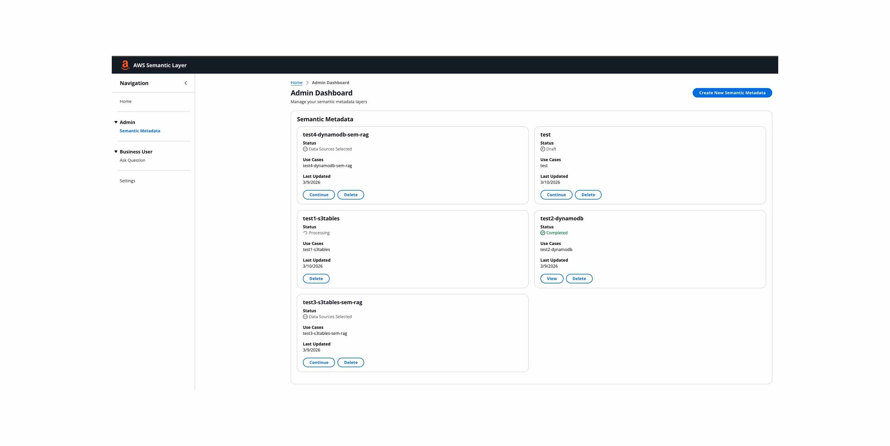

# Sample Semantic Layer for Structured Data

## Overview

This sample architecture illustrates two alternative semantic layer approaches for structured data:

1. **Virtual Knowledge Graph (VKG)**: OWL ontology stored in Amazon Neptune; natural language queries are translated to SQL via ontology mappings
2. **Semantic RAG**: Semantic metadata stored in Amazon Bedrock Knowledge Base; natural language queries use RAG for context-aware SQL generation

Both approaches share the same admin workflow up to the point of choosing the semantic layer type.

> **📊 Background / concepts:** For the _why_ behind this project — the two failure modes of
> agentic text-to-SQL (grounding vs. delivery), how a semantic layer + ontology and progressive
> disclosure address them, and the tiered query path — see the companion presentation
> [`assets/guides/semantic-layer.pptx`](assets/guides/semantic-layer.pptx).

### Key Capabilities

- **Dual Semantic Layer Modes**: Choose VKG (Neptune-based ontology) or Semantic RAG (Bedrock KB-based metadata)
- **AI-Powered Metadata Enrichment**: Automated descriptions for databases, tables, and columns written back to Glue Data Catalog and S3 Tables metadata
- **AI-Assisted Metadata Generation**: Versioned, iterative semantic layer creation with human in the loop
- **Natural Language Queries**: Query data across sources using plain English
- **Multi-Turn Conversational Chat**: Streaming AG-UI chat with persisted session history, per-turn reasoning trace, and follow-up context (DynamoDB-backed transcripts)
- **MCP Server**: An AgentCore Gateway exposes the query agents as MCP tools (`ListOntologies`, `OntologyQuery`, `MetadataQuery`, `QuerySuggestions`) to Claude Code, Cowork, Cursor, VS Code, and other MCP clients over OAuth 2.0 — see [`assets/guides/MCP_SERVER.md`](assets/guides/MCP_SERVER.md)
- **User Feedback**: 👍/👎 ratings + comments per assistant turn, PII-redacted by Guardrails and stored in DynamoDB; surfaced in the admin Feedback tab
- **Lessons Learned / Long-Term Memory**: Bedrock AgentCore Memory mines durable lessons from chat sessions (SemanticStrategy) and injects them as prior context into future queries; surfaced in the admin Lessons Learned tab
- **Ground-Truth Evaluations**: Per-layer ground-truth datasets drive AgentCore on-demand + online evaluation runs (accuracy / latency / token metrics) surfaced in the admin Evaluations tab
- **Production Monitoring**: Read-only admin Monitoring tab reporting how live queries resolved per layer — bucketed by each answer's persisted `provenance.tier` into metric / semantic / advisory / agentic(-not-implemented) resolution layers — plus a correction-language rate (share of user turns that read as a correction) correlated with the count of lessons AgentCore Memory has extracted
- **Adversarial Red-Teaming**: Automated guardrail red-team suite (Strands Evals, `CrescendoStrategy`) probing the query agents across 5 OWASP-aligned risk categories; run manually today — see [`tests/eval/RED_TEAM_IMPLEMENTATION.md`](tests/eval/RED_TEAM_IMPLEMENTATION.md)
- **Two-Tier Query Path**: A Tier 1 **governed-metric lookup** first matches the question (Titan-v2 embedding + KNN, cosine ≥ 0.85) against maintained/published metrics and, on a clear match, runs that metric's pre-validated SQL on Athena — returning early. Otherwise it falls through to a Tier 2 deterministic Strands graph (topic router → disambiguation → slice builder → SQL/SPARQL generate+validate → grounding gate + bounded execution) with clarification loops
- **Maintained Metrics (governed)**: curated metrics (name/description/synonyms + pre-validated SQL) stored in DynamoDB with a DRAFT → APPROVED → PUBLISHED lifecycle; published metrics are embedded for the Tier 1 lookup and authored via the `/metrics` API (gated by `METRICS_TABLE`)
- **Ontology in Neptune**: Business concepts, relationships, and mappings stored as RDF/OWL
- **Data in Source Systems**: Actual data remains in source systems
- **Query Translation**: AI agents use semantic layer to translate natural language into SQL/SPARQL queries (VKG: SPARQL→SQL via Ontop reformulation on Athena)

## Demo

### Virtual Knowledge Graph Flow



### Semantic RAG Flow


## Architecture


## Technology Stack

### Frontend

- **Framework**: React 18
- **UI Library**: AWS Cloudscape Design System 3.0
- **Authentication**: AWS Amplify Auth (Cognito)
- **HTTP Client**: Axios (`^1.16.0`)
- **Routing**: React Router v6
- **Streaming Chat**: AG-UI Server-Sent Events (SSE) over fetch + ReadableStream, streamed directly through the Chat AgentCore Gateway (JWT)
- **Hosting**: CloudFront + S3

### Backend & Infrastructure

- **Infrastructure as Code**: AWS CDK v2 (TypeScript)
- **API Layer**: AWS Lambda with Python FastAPI
- **AI Framework**: Strands Agents SDK
- **LLM**: Amazon Bedrock
- **Container Registry**: Amazon ECR
- **Agent Runtime**: Amazon Bedrock AgentCore Runtime (5 runtimes)
- **Agent Gateways**: Amazon Bedrock AgentCore Gateway — MCP server (tools), MCP OAuth proxy, streaming chat, and Neptune/Ontop SPARQL→SQL
- **Long-Term Memory**: Amazon Bedrock AgentCore Memory (SemanticStrategy) for lessons-learned mining
- **Agent Evaluation**: Amazon Bedrock AgentCore Evaluation (on-demand batch + online sampling) against per-layer ground-truth datasets
- **SPARQL→SQL Translation**: Ontop reformulation (Java 21 Lambda on the Neptune Gateway)

### Data & Knowledge Layer

- **Graph Database**: Amazon Neptune (RDF/SPARQL) — VKG mode
- **Vector Store**: Amazon Bedrock Knowledge Base (S3 Vectors) — ontology-patterns (VKG) + semantic-rag (Semantic RAG)
- **Operational Data**: Amazon DynamoDB (12 insurance tables)
- **Application State**: Amazon DynamoDB — `semantic-layer-metadata` (ontology/job state), `…-chat-sessions` (multi-turn transcripts, TTL), `…-feedback` (👍/👎 + comments), `…-metrics` (governed metrics + embeddings, Tier 1) tables
- **Analytical Data**: Amazon S3 Tables (Apache Iceberg format)
- **Real-Time CDC**: DynamoDB Streams → Lambda (PyIceberg) → S3 Tables
- **Batch Replication**: AWS Glue Zero-ETL integration
- **Normalized Views**: AWS Glue 5.1 Materialized Views (40 Iceberg MVs in `normalized` namespace)
- **Metadata Catalog**: AWS Glue Data Catalog (AI-enriched descriptions)
- **Query Engine**: Amazon Athena (with DynamoDB Connector + S3 Tables catalog)

### Security & Observability

- **Authentication**: Amazon Cognito (OAuth 2.0 + PKCE); CUSTOM_JWT authorizers on the MCP/chat gateways; M2M `client_credentials` for backend service-to-runtime calls
- **AI Safety**: Amazon Bedrock Guardrails (INPUT/OUTPUT screening on queries; PII redaction on feedback + memory writes); adversarial red-team suite validating the guardrails under attack — see [`tests/eval/RED_TEAM_IMPLEMENTATION.md`](tests/eval/RED_TEAM_IMPLEMENTATION.md)
- **Observability**: AWS OpenTelemetry Distro; AgentCore online + on-demand evaluation; CloudWatch custom chat metrics
- **Secrets**: AWS Secrets Manager + Systems Manager Parameter Store
- **Network**: Lake Formation permissions for S3 Tables access control

## User Stories & Features

### Admin Flow

#### 1. Describe Application Intent

**Implementation**: `frontend/src/pages/admin/DescribeIntent.jsx`

- Text input for data source descriptions and business use cases
- Stores configuration in DynamoDB `semantic-layer-metadata` table

#### 2. Select Data Sources

**Implementation**: `frontend/src/pages/admin/SelectDataSources.jsx`

- Multi-select from Glue Catalog databases/tables (including S3 Tables/Iceberg)
- Optional file upload for existing ontology/documentation
- Each selected table includes its Athena `catalogId` for federated routing

#### 3. Review Metadata

**Implementation**: `frontend/src/pages/admin/ReviewMetadata.jsx`

- Read-only view of Glue Catalog metadata (tables, columns, data types)

#### 4. Select Semantic Layer Type ^1

**Implementation**: `frontend/src/pages/admin/SelectSemanticLayerType.jsx`

- **VKG**: Generates OWL ontology stored in Amazon Neptune and Amazon S3
- **Semantic RAG**: Generates AI metadata stored in Amazon Bedrock Knowledge Base and Amazon S3

#### 5a. Build Knowledge Graph (VKG path) ^1

**Implementation**: `frontend/src/pages/admin/BuildKnowledgeGraph.jsx`

- Triggers Ontology Agent via Lambda API
- Progress: extracting metadata → retrieving patterns → generating OWL → loading to Neptune

#### 5b. Build Semantic Metadata (Semantic RAG path)

**Implementation**: `frontend/src/pages/admin/BuildSemanticMetadata.jsx`

- Triggers Metadata Agent via Lambda API
- Progress polling: per-table status with `tablesProcessed / totalTables`
- Agent writes descriptions to Glue Catalog and saves Markdown docs to S3/KB

#### 6. View Results & Manage the Layer

The admin detail screen (`ViewKnowledgeGraph.jsx` for VKG, `ViewSemanticRAGMetadata.jsx` for
Semantic RAG) hosts tabbed management surfaces:

- **Metadata / Knowledge Graph**: ontology editor (VKG graph visualization ^1) or enriched metadata view
- **Data Sources**: the tables backing the layer
- **Feedback** (`frontend/src/components/FeedbackTab.jsx`): per-turn 👍/👎 ratings + comments collected from chat, PII-redacted by Guardrails
- **Lessons Learned** (`frontend/src/components/LessonsLearnedTab.jsx`): long-term lessons mined from chat sessions by AgentCore Memory
- **Ground Truth** (`frontend/src/pages/admin/GroundTruthDataset.jsx`): upload/inspect the per-layer evaluation dataset
- **Evaluations** (`frontend/src/pages/admin/Evaluations.jsx`): AgentCore evaluation runs (accuracy / latency / token metrics)
- **Monitoring** (`frontend/src/components/MonitoringTab.jsx`): live query-resolution breakdown (metric / semantic / advisory / agentic) bucketed by each answer's persisted `provenance.tier`, plus a correction-language rate correlated with extracted lessons
- **Supplementary Docs** (`frontend/src/pages/admin/UploadSupplementaryDocs.jsx`): upload extra reference docs into the doc-pipeline → KB

^1 Optional: If "enableOntologyAgents": false, then this screen is disabled and SemanticRAG is selected as default

### End User Flow (Querying)

#### Conversational Chat (multi-turn)

**Implementation**: `frontend/src/pages/query/` — `AskQuestion.jsx` (route), `LandingPage.jsx`
(layer picker + empty-state composer), `ChatView.jsx`, `ChatTranscript.jsx`, `Composer.jsx`,
`ReasoningPanel.jsx`, `ResultPanel.jsx`, `FeedbackBar.jsx`; state machine in
`frontend/src/hooks/useChatStream.js`, sidebar history in `useChatSessions.js`.

- **Streaming, multi-turn chat**: AG-UI events stream over SSE directly through the Chat
  AgentCore Gateway (JWT). Transcripts persist in the `chat-sessions` DynamoDB table (TTL 24h),
  so refreshing or clicking a past session in the sidebar rehydrates the conversation.
- Routes to the correct query agent based on layer type:
  - **VKG**: Ontology Query Agent — Neptune topic routing → SPARQL → **Ontop SPARQL→SQL** → Athena
  - **Semantic RAG**: Metadata Query Agent — KB slice retrieval → SQL → Athena
- **Per-turn reasoning trace**: the tiered workflow emits phase events (router, disambiguation,
  slice builder, SQL/SPARQL generate+validate, grounding/execution) rendered in `ReasoningPanel`,
  including the executed SQL, result table (CSV download), and the Semantic-RAG slice (JSON
  download).
- **Per-turn feedback**: 👍/👎 with an optional comment writes to `POST /query/feedback`.
- **Dynamic Suggested Questions**: selecting a layer calls `GET /query/suggestions/{id}` for 3
  AI-generated questions from the Query Suggestions Agent, shown with category labels.

## Data Sources

> **🧪 Sample structure, synthetic data.** This is a **reference data model**, not a real
> dataset. The 12 operational tables follow the **ACORD** insurance data standard (an industry
> reference schema) and are populated entirely with **synthetic, machine-generated data** — no
> real customer, policy, or financial records. The data is produced by
> [`scripts/generate_complete_synthetic_data.py`](scripts/generate_complete_synthetic_data.py)
> and loaded via [`scripts/load_to_dynamodb.py`](scripts/load_to_dynamodb.py) when
> `enableAcordSampleData` is set — **on by default** in the committed `cdk.json`; deploy with
> `-c enableAcordSampleData=false` to skip the synthetic rows (see [Deployment Modes](#deployment-modes)).
> Adapt the schema and loaders to your own structured sources to reuse the semantic-layer
> architecture.

### 1. DynamoDB - Operational Data (12 tables)

`HOLDING`, `PARTY`, `COVERAGE`, `RIDER`, `RELATION`, `FINANCIALACTIVITY`, `FINANCIALSTATEMENT`, `POLICYPRODUCT`, `COVERAGEPRODUCT`, `INVESTPRODUCT`, `TYPE_CODES`, `ADMIN_CODES`

**Access**: Athena with DynamoDB Connector (`lambda:` catalog)

### 2. S3 Tables (Apache Iceberg) - Analytical Data

**Real-time CDC pipeline** ^2

```
DynamoDB Streams → Lambda (PyIceberg) → S3 Tables (Iceberg)
                                         ↑
                   Glue Zero-ETL (batch) ─┘
```

- Sub-second latency via DynamoDB Streams + Lambda
- True schema evolution via Iceberg spec
- UPSERT/DELETE support via PyIceberg atomic operations
- Registered as `s3tablescatalog` catalog in Athena
- Governed via Lake Formation

^2 Optional: Enabled if "enableRealtimeReplication": true

**Batch pipeline** (alternative to the real-time CDC pipeline) ^3

```
DynamoDB table → Zero-ETL integration → S3 Tables (zetl_<uuid> namespace)
                                                  ↓
                                        Glue 5.1 Materialized Views
                                                  ↓
                                        S3 Tables (normalized namespace)
                                        └─ 40 entity tables (holding, party,
                                           coverage, rider, relation, ...)
```

- Glue Zero-ETL integration per DynamoDB table → S3 Tables (`zetl_<uuid>` namespace per integration)
- **NormalizedViewsStack**: Glue 5.1 PySpark job creates 40 Iceberg Materialized Views in a `normalized` namespace, applying `sk LIKE '<Prefix>#%'` filters to demultiplex each flat Zero-ETL table into its constituent entity tables
- Scheduled refresh every 6 hours via EventBridge; incremental Iceberg refresh where possible
- `zetl_*` namespaces are internal replication staging — the `normalized` namespace is the user-facing analytical layer

^3 Optional: Enabled if "enableBatchReplication": true

## AI Agents (Strands Framework)

### 1. Ontology Generation Agent (VKG)

**Location**: `agents/ontology_agent/main.py`

**Purpose**: Generates OWL ontologies from Glue schemas and table sampling using user-provided documentation and sample ontology patterns retrieved via RAG from Bedrock KB.

**Three sub-agents**: Phase 1 (per-table N-Quads), Phase 2 (FK refinement + Neptune persist), Revision (targeted edits)

**Phase 1 tools** (per-table, fresh agent per table):

```python
get_single_table_schema(database_name, table_name, catalog_id)  # Athena DESCRIBE + Glue fallback
sample_table_data(database_name, table_name, catalog_id)        # Athena SELECT + DynamoDB fallback
retrieve_ontology_patterns(schema_description, max_patterns)    # RAG from Bedrock KB
download_document_from_s3(s3_path)                             # download reference docs
search_document(file_path, search_term, context_lines)
read_document_lines(file_path, start_line, num_lines)
append_nquads(ontology_id, table_name, nquad_batch)            # batched N-Quad writing (≤70 lines)
save_intermediate_ontology(ontology_id, table_name, ...)       # finalize + S3 save
update_progress(ontology_id, tables_processed, total_tables, current_table)
```

**Phase 2 tools** (per-table, fresh agent per table):

```python
append_fk_triples(ontology_id, table_name, fk_nquads)         # add FK ObjectProperty triples
persist_file_to_neptune(ontology_id, table_name)               # read file → AgentCore GW → Neptune
update_glue_metadata_from_ontology(ontology_id, database_name, table_name, catalog_id)
```

**Assembly** (Python, not agent): concatenate all per-table N-Quads → save consolidated `ontology.nq` to S3

**Post-assembly**: write Iceberg column doc strings + table descriptions to S3 Tables metadata via pyiceberg

**Revision tools**: `download_document_from_s3`, `search_document`, `read_document_lines`, `apply_targeted_edits`, `persist_revision_from_s3`

**Output**: N-QUADS in Neptune named graphs (via AgentCore Gateway) with `mapsToTable`/`mapsToColumn` traceability predicates; column descriptions written to Glue Data Catalog and Iceberg S3 metadata.

### 2. Metadata Generation Agent (Semantic RAG)

**Location**: `agents/metadata_agent/main.py`

**Purpose**: Create semantic metadata and save it in Glue Catalog, S3 Table metadata, and as markdown metadata documents to S3 for Bedrock KB ingestion. Supports two operational modes: **standard enrichment** and **annotation-only revision**.

**Tools** (shared by both modes):

```python
get_single_table_schema(database_name, table_name, catalog_id)
sample_table_data(database_name, table_name, catalog_id)
download_document_from_s3(s3_path)
search_document(file_path, search_term, context_lines)
read_document_lines(file_path, start_line, num_lines)
update_glue_table_metadata(database_name, table_name, table_description, column_descriptions, catalog_id)
update_glue_database_description(database_name, description)
save_metadata_document_to_s3(database_name, table_name, catalog_id, metadata_content)
update_progress(job_id, tables_processed, total_tables, current_table)
```

**Standard enrichment workflow** (per table, fresh agent per table):

1. For each unique database: write AI description to Glue
2. For each table: DESCRIBE schema → sample data (+ reference docs if uploaded) → generate descriptions → write to Glue & S3 Table Metadata → save Markdown to S3 → update progress
3. After all tables: trigger Bedrock KB ingestion job
4. Returns immediately (async); status polled via `jobId` in DynamoDB

**Annotation mode** (`ANNOTATION_SYSTEM_PROMPT`): Triggered when `annotations` are included in the enrichment payload. Skips data sampling and reference docs. Reads existing Glue descriptions as baseline, applies targeted per-column/per-table annotation hints, leaves all non-targeted descriptions unchanged, and rewrites the S3 Knowledge Base document.

**Versioning** (pointer + history pattern): Mirrors the ontology agent. When `revisionMode=True`:

1. Service stamps v1 with `revisionMode`, `targetVersion` (e.g. `v2`), and `revisionInstructions`
2. Agent runs enrichment/annotation as normal
3. On completion: `_write_versioned_completion()` writes an immutable history record (SK = `v2`) then updates v1 as the mutable current pointer (`currentVersion = v2`, `revisionMode = False`)

**Federated catalog routing**: The `catalogId` per table (e.g. `s3tablescatalog/<bucket>`) is resolved automatically. For S3 Tables, `versionToken` is fetched from the S3 Tables API on Glue update conflicts (retry-on-exception pattern).

### 3. Ontology Query Agent (VKG)

**Location**: `agents/ontology_query_agent/main.py` (+ `tier2/` workflow, shared graph in `agents/shared/tier2_graph.py`)

**Tier 1 — governed-metric lookup** (`agents/shared/metric_lookup.py` + `metric_executor.py`):
before the graph runs, the question is embedded (Titan v2) and KNN-matched against published
maintained metrics for the namespace. On a clear hit (cosine ≥ 0.85) the metric's pre-validated
`compiled_sql` is executed on Athena and the answer is returned early — short-circuiting Tier 2.
Any miss or error falls through (fail-soft). The response is shaped like a Tier 2 result
(`metadata.tier = 1`), so the UI is tier-agnostic. This cascade is identical in the
Semantic-RAG agent below.

**Tier 2 — Strands-graph workflow** (`agents/ontology_query_agent/tier2/workflow.py`), run only
when Tier 1 finds no match:

```
Phase 1  Topic router          KNN/lexical → candidate class + property IRIs
Phase 2  Term disambiguation   term → IRI; >1 class IRI → clarification
Phase 3  Slice builder + judge  SPARQL CONSTRUCT (n-hops) → Turtle slice
Phase 3b Slice disambiguation   property collision / multi class-path
Phase 4  SPARQL generate + validate (rdflib parseQuery + 1 repair)
Phase 5  Grounding gate → Ontop SPARQL→SQL translate → Athena execute (+ SQL repair)
```

- Grounding back-edge: an out-of-slice-but-real IRI loops to Phase 3 (expand the slice); a
  hallucinated/misused IRI loops to Phase 4 (regenerate with feedback).
- **Phase 5 execution**: the grounded SPARQL is lineage only (Neptune is schema-only); the
  `translate_sparql_to_sql` Ontop Lambda (Java, on the Neptune Gateway) reformulates it to Athena
  SQL, which the agent executes — with a bounded LLM SQL-repair retry on Athena failures.
- **Dynamic row limits**: default 10, user-specified (e.g. "top 30"), max 100.

### 4. Metadata Query Agent (Semantic RAG)

**Location**: `agents/metadata_query_agent/main.py` (+ `tier2/` workflow, shared graph in `agents/shared/tier2_graph.py`)

**Purpose**: Answers natural-language questions over the Semantic-RAG layer using the same
two-tier cascade as the VKG agent — **Tier 1 governed-metric lookup** first (see §3), then the
Tier 2 Strands graph specialized for KB-backed metadata when no metric matches:

```
Phase 1  Topic router          KB retrieval → candidate tables (+ scores)
Phase 2  Term disambiguation   term → table; ambiguity → clarification
Phase 3  Slice builder + judge  parse KB markdown chunks → JSON slice
                                (tables/columns/joins/acord_paths/query_patterns)
Phase 3b Slice disambiguation   slice-level collision → clarification
Phase 4  SQL generate + validate (sqlglot parse + 1 repair)
Phase 5  Grounding gate → bounded execution agent → Athena execute
```

- The Phase 3 slice (the grounding context) is surfaced to the chat UI for view + JSON download.
- Grounding back-edge loops to Phase 4 (a hallucinated column can't be fixed by widening the slice).

### 5. Query Suggestions Agent

**Location**: `agents/query_suggestions_agent/main.py`

**Purpose**: Generates 3 dynamic, contextually relevant suggested questions for the Natural Language Query UI by retrieving schema context from the Bedrock Knowledge Base for the selected semantic layer.

**Tools**:

```python
retrieve_kb_context(user_query)   # retrieves schema docs from Bedrock KB (top 10 results)
```

**Workflow**:

1. Receives `{"id": "<ontology_config_id>"}` payload from AgentCore entrypoint
2. Looks up the metadata config name from DynamoDB
3. Agent calls `retrieve_kb_context("list all available tables and their columns and business purpose")`
4. LLM analyses schema context and generates 3 categorised questions
5. Returns `{"suggestions": [{"category": "...", "question": "..."}, ...]}`

**Invocation**: Synchronous — no polling required. Called via `GET /query/suggestions/{ontology_id}`.

## Platform Features (cross-cutting)

### Maintained Metrics (Tier 1 — progressive disclosure)

Before the Tier 2 Strands graph runs, both query agents try a **governed-metric lookup** that
short-circuits the expensive ontology/KB resolution when a curated metric answers the question.

- **What a metric is** (`agents/shared/metric_models.py`): a Pydantic `Metric` with
  `metric_id`, `namespace`, `name`, `description`, `synonyms`, a pre-validated `compiled_sql`
  (+ `dialect`), `supported_dimensions` / `supported_filters`, an optional `linked_class` (VKG),
  a `lifecycle` (DRAFT → APPROVED → PUBLISHED), and `version`.
- **Storage**: the `semantic-layer-metrics` DynamoDB table (`pk = NS#{namespace}`,
  `sk = METRIC#{metric_id}`). On **publish**, `name + description + synonyms` are embedded with
  Bedrock Titan v2 (1024-dim) and stored on the row; DRAFT metrics skip the embedding cost.
- **Matching** (`agents/shared/metric_lookup.py`): embed the question, KNN-search an in-memory
  index (hydrated lazily from DynamoDB, namespace pre-filtered), and accept the top hit only if
  cosine similarity ≥ `0.85` (configurable). No LLM is involved. Fail-soft — any miss, error, or
  index drift falls through to Tier 2 (never a 500).
- **Execution** (`agents/shared/metric_executor.py`): apply any allowed filters via sqlglot AST
  (never string concat), run the SELECT-only SQL on Athena, and shape the rows. The response is
  built to match the Tier 2 payload (`metadata.tier = 1`) so the frontend is tier-agnostic.
- **Authoring/maintenance**: the `/metrics` CRUD router (`lambda/rest-api/routers/metrics.py`,
  `services/metric_service.py`) mounts only when `METRICS_TABLE` is set; SQL is validated
  SELECT-only with sqlglot at write time, and the embedding is (re)computed on publish.

### MCP Server (AgentCore Gateway)

**Guide**: [`assets/guides/MCP_SERVER.md`](assets/guides/MCP_SERVER.md)

An AgentCore Gateway (CUSTOM_JWT, Cognito) exposes the query agents as MCP tools —
`ListOntologies` (discover published layers + their VKG/Semantic-RAG mode, call first),
`OntologyQuery`, `MetadataQuery`, `QuerySuggestions` — to MCP clients (Claude Code, Cursor,
VS Code, MCP Inspector). The Gateway forwards each `tools/call` to the **`lambda/mcp-tools`**
Lambda (INPUT guardrail → invoke runtimes over HTTPS with an M2M OAuth bearer → OUTPUT guardrail).
The **`lambda/mcp-proxy`** OAuth proxy (HTTP API + Lambda) runs the MCP OAuth 2.0 flow
(RFC 8414/9728 discovery + Authorization Code + PKCE + Dynamic Client Registration) so clients
log in via the browser. `OntologyQuery` returns `{answer, rows, sparql, sql, executed_sql,
lineage}`; `MetadataQuery` returns the retrieved slice instead of lineage.

### Lessons Learned / Long-Term Memory (AgentCore Memory)

A single Bedrock AgentCore Memory resource with a **SemanticStrategy** backs the lessons-learned
feature. The Strands `memory_hooks` (`agents/shared/memory_hooks.py`) write each PII-redacted turn
into short-term memory; AgentCore asynchronously extracts durable lessons. On a new query, the
agent injects relevant prior lessons + prior results as context. Admins browse/delete records via
the Lessons Learned tab (`GET/DELETE /lessons/{ontology_id}`).

### Ground-Truth Evaluations (AgentCore Evaluation)

Admins upload a per-layer ground-truth dataset (`POST /groundtruth/{id}/upload`) — JSON records of
`Natural_Language_Question` / `Expected_Answer` / `Expected_SQL_Query` / `Expected_SQL_Result`.
The `agentcore-eval` stack configures **online** evaluation (sampling) on all runtimes; the
Evaluations tab triggers **on-demand** batch runs and shows per-evaluator scores
(`GET /evaluations/{id}`, `POST /evaluations/{id}`). Built-in evaluators include
ToolParameterAccuracy, ToolSelectionAccuracy, and GoalSuccessRate.

### Production Monitoring (query-resolution signals)

A read-only admin **Monitoring** tab (`GET /monitoring/{id}` → `services/monitoring_service.py`)
reports two signals about a layer's LIVE query traffic, scoped per layer:

- **Resolution-layer breakdown**: every answered turn is bucketed by its persisted
  `totals.provenance.tier` into **metric** (Tier 1 governed metric), **semantic** (Tier 2 graph —
  `semantic_sql` + `vkg` both fold here), **advisory** (schema / "what can I ask" answers), and
  **agentic** (planned, always 0 — surfaced explicitly rather than hidden). Turns with no
  recognized tier are skipped so they don't dilute the buckets.
- **Correction-language rate**: the `correction_language.is_correction` heuristic runs over each
  persisted user turn; the share that read as a correction ("that's the wrong table") is reported
  alongside the count of long-term lessons AgentCore Memory has extracted (each correction is a
  candidate lesson), so the operator can see whether corrections are being captured durably.

Data comes from a bounded `FilterExpression` Scan of the TTL-bounded `chat-sessions` table (no
GSI on `ontologyId`, no per-turn version → scoped to the layer, all versions). Read-only — no
agent-runtime change; the REST Lambda already had the needed IAM + catch-all route.

### Document Pipeline (supplementary docs → KB)

A staged Lambda pipeline (`lambda/doc-pipeline`: chunk → NER → embed → link → index) ingests
admin-uploaded reference documents into the Bedrock Knowledge Base
(`POST /documents/{id}/upload`), enriching the retrieval context for both modes.

## CDK Infrastructure (TypeScript)

### Stack Architecture (up to 21 stacks)

17 stacks deploy unconditionally; 4 are flag-gated. Three flags gate whole stacks (defaults are
the values committed in [`cdk/cdk.json`](cdk/cdk.json) — flip a flag and that stack is added or
dropped regardless of the default):

- `enableRealtimeReplication` (default `false`) → 1 stack (`stream-processor`)
- `enableBatchReplication` (default `true`) → 2 stacks (`zeroetl` + `normalized-views`)
- `enableOntologyAgents` (default `true`) → 1 stack (`neptune`)

The other deployment flags (`enableSemanticRag`, `enableAcordSampleData`, `enableOboPassthrough`)
do **not** add or remove stacks — they toggle resources _inside_ always-deployed stacks (e.g.
runtimes within `agentcore`, the synthetic-data loader within `dynamodb`). See
[Deployment Modes](#deployment-modes) for what every flag does.

```
1.  semantic-layer-networking
    └─> VPC, Subnets, Security Groups, VPC Endpoints

2.  semantic-layer-dynamodb
    └─> 12 insurance tables + metadata/chat-sessions/feedback tables + synthetic data loader

3.  semantic-layer-glue-catalog
    └─> Depends on: dynamodb
    └─> DynamoDB Glue database + crawler; Iceberg Glue database

4.  semantic-layer-data-lake
    └─> Depends on: glue-catalog
    └─> S3 Tables bucket (Iceberg), artifacts bucket, athena results,
        KB bucket, logging bucket; Lake Formation grants

5.  semantic-layer-stream-processor  [enableRealtimeReplication=true]
    └─> Depends on: dynamodb, data-lake
    └─> DynamoDB Streams → Lambda (PyIceberg) → S3 Tables CDC pipeline
        DLQ, per-table stream processors, backfill Lambda

6.  semantic-layer-zeroetl  [enableBatchReplication=true]
    └─> Depends on: dynamodb, data-lake
    └─> 12 Glue Zero-ETL integrations: DynamoDB table → S3 Tables
        (each integration creates a zetl_<uuid> namespace)

7.  semantic-layer-normalized-views  [enableBatchReplication=true]
    └─> Depends on: zeroetl, data-lake
    └─> Glue 5.1 PySpark job: 40 Iceberg Materialized Views in
        'normalized' S3 Tables namespace; EventBridge 6h refresh schedule
        IAM role + LF grants on all zetl_* namespaces + normalized

8.  semantic-layer-neptune  [enableOntologyAgents=true]
    └─> Depends on: networking
    └─> Neptune cluster (RDF/SPARQL) in VPC

9.  semantic-layer-bedrock-kb
    └─> Depends on: data-lake
    └─> Knowledge Base (S3 Vectors); dual use:
        ontology patterns (VKG) + enriched metadata (Semantic RAG)

10. semantic-layer-athena
    └─> Depends on: data-lake, glue-catalog, dynamodb, networking
    └─> Workgroup, DynamoDB connector, Lake Formation admin chain

11. semantic-layer-agentcore-memory
    └─> Bedrock AgentCore Memory (single resource, SemanticStrategy) for lessons-learned

12. semantic-layer-guardrails
    └─> Bedrock Guardrails (content filters + PII detection)

13. semantic-layer-cloudfront-storage
    └─> Depends on: data-lake
    └─> CloudFront distribution + S3 website bucket + OAC

14. semantic-layer-auth
    └─> Depends on: cloudfront-storage
    └─> Cognito User Pool, Identity Pool, OAuth 2.0 (+ M2M client, MCP scope)

15. semantic-layer-agentcore
    └─> Depends on: neptune, bedrock-kb, glue-catalog, athena, data-lake, agentcore-memory, auth
    └─> 5 AgentCore Runtimes + ECR repo + Neptune Gateway construct
        (Ontop SPARQL→SQL translate Lambda); JWT-inbound runtimes
        LF SELECT grants on normalized namespace (when enableBatchReplication=true)

16. semantic-layer-agentcore-eval
    └─> Depends on: agentcore
    └─> Online evaluation configs (sampling) for the AgentCore query runtimes

17. semantic-layer-doc-pipeline
    └─> Depends on: data-lake, bedrock-kb
    └─> Staged Lambda doc-ingestion pipeline (chunk → NER → embed → link → index)

18. semantic-layer-lambda-api
    └─> Depends on: auth, data-lake, dynamodb, agentcore, agentcore-memory, doc-pipeline
    └─> FastAPI Lambda + HTTP API Gateway (JWT) + Lake Formation grants

19. semantic-layer-mcp-server
    └─> Depends on: agentcore, auth, guardrails
    └─> MCP Gateway (CUSTOM_JWT) + mcp-tools Lambda + streaming Chat Gateway

20. semantic-layer-mcp-proxy
    └─> Depends on: mcp-server, auth
    └─> MCP OAuth 2.0 proxy (HTTP API + Lambda) for Claude Code / Cursor / VS Code

21. semantic-layer-frontend
    └─> Depends on: cloudfront-storage, auth, lambda-api, mcp-server
    └─> React build + S3 sync + CloudFront invalidation

```

### Stack Details

#### DynamoDB Stack (`dynamodb-stack.ts`)

- 12 insurance domain tables with DynamoDB Streams enabled (NEW_AND_OLD_IMAGES)
- `semantic-layer-metadata` table for ontology/metadata job tracking
- `…-chat-sessions` (multi-turn transcripts, TTL), `…-feedback` (👍/👎 + comments), and
  `…-metrics` (governed metrics + Titan-v2 embeddings for the Tier 1 lookup) tables
- Synthetic data loader Lambda

#### Data Lake Stack (`data-lake-stack.ts`)

- **S3 Tables bucket**: Apache Iceberg tables (replaces plain Parquet)
- **Artifacts bucket**: Ontologies (Turtle), metadata documents (Markdown)
- **Athena results bucket**: Query result storage with 7-day lifecycle
- **Knowledge Base bucket**: Source docs for Bedrock KB
- **Lake Formation**: Grants for stream processor, Athena execution role, agent roles
- Exports `lfGrantSingletonRoleArn` to preserve LF admin chain across stacks

#### Glue Catalog Stack (`glue-catalog-stack.ts`)

- `insurance_dynamodb` database: DynamoDB tables via crawler
- `insurance_iceberg` database: S3 Tables (Iceberg) namespace
- Auto-starts DynamoDB crawler on deployment

#### DynamoDB Stream Processor Stack (`dynamodb-stream-processor-stack.ts`)

- Per-table Lambda functions consuming DynamoDB Streams
- Writes to S3 Tables via PyIceberg (ARM64 Docker container)
- SQS Dead Letter Queue with 14-day retention
- Backfill Lambda for initial data load
- CodeBuild (ARM64) for container image build and push

#### Zero-ETL Stack (`zeroetl.ts`)

- 12 Glue Zero-ETL integrations — one per DynamoDB source table → S3 Tables
- Each integration creates a `zetl_<uuid>` namespace in the S3 Tables bucket
- Multiple deployments create multiple UUID namespaces; the NormalizedViewsStack job dynamically discovers the newest per source table at runtime
- Managed batch replication as alternative to the real-time stream processor

#### Normalized Views Stack (`normalized-views-stack.ts`)

- **Glue 5.1 PySpark job** (`glue/create-normalized-views.py`): creates 40 Apache Iceberg Materialized Views in a `normalized` S3 Tables namespace from Zero-ETL source tables
- **Namespace discovery**: job discovers the most-recently-created `zetl_*` namespace per source table at runtime via `
- **Idempotent**: `CREATE MATERIALIZED VIEW IF NOT EXISTS` + `REFRESH MATERIALIZED VIEW` — safe to re-run
- **Spark conf**: S3Tables Glue catalog with `client.region` (required by `LakeFormationAwsClientFactory`) and `warehouse` (required by catalog plugin initialisation)
- **EventBridge rule**: triggers job every 6 hours; incremental Iceberg refresh where possible
- **Lake Formation**: SELECT grants on all `zetl_*` namespaces (both current and historical); `AwsCustomResource` pre-creates `normalized` namespace at deploy time so LF `CREATE_TABLE` grant succeeds

#### AgentCore Stack (`agentcore-stack.ts`)

- **5 AgentCore Runtimes**: `ontology`, `query` (VKG), `metadata`, `metadata-query` (Semantic RAG), `query-suggestions`
- **Feature flag**: VKG-related resources (ontology runtime, query runtime, Neptune Gateway) are conditionally deployed only when both `neptuneStack` and `bedrockKbStack` are provided — allows deploying in Semantic RAG-only mode
- **AgentCore Neptune Gateway**: HTTP gateway construct enabling agents to access Neptune without VPC; also hosts the **Ontop SPARQL→SQL translate** Lambda (Java 21, `lambda/ontop-translate`) used by VKG Phase 5
- **JWT-inbound runtimes**: the query runtimes accept Cognito JWT (no SigV4), enabling the MCP/chat gateways and the browser to invoke them with bearer tokens
- Shared ECR repository; CodeBuild (ARM64) per agent
- IAM roles with least-privilege per agent type
- Lake Formation permissions for Iceberg table access

#### Lambda REST API Stack (`lambda-rest-api/index.ts`)

- FastAPI container on Lambda; sub-apps mounted at `/ontology`, `/datasource`, `/query`, `/metadata`, `/neptune`, `/lessons`, `/feedback`, `/documents`, `/groundtruth`, `/evaluations`, `/monitoring` (with `/query` carrying the chat-session and per-turn feedback sub-routes)
- **Endpoints** (selected):
  - `POST /ontology/config` — create/update ontology config
  - `GET /ontology/config/{ontology_id}` — get config
  - `GET /ontology/list` — list all configs
  - `DELETE /ontology/config/{ontology_id}` — delete config
  - `POST /ontology/build/{ontology_id}` — trigger Ontology Agent (VKG)
  - `GET /ontology/build-status/{ontology_id}` — poll build progress
  - `GET /ontology/versions/{ontology_id}` — list ontology version history
  - `GET /ontology/content/{ontology_id}/{version_id}` — retrieve version content
  - `POST /ontology/revise/{ontology_id}/{version_id}` — start versioned ontology revision
  - `POST /ontology/upload` — upload reference document
  - `POST /metadata/enrich` — trigger Metadata Agent (Semantic RAG); accepts optional `annotations` for annotation-only mode
  - `GET /metadata/enrich/status/{job_id}` — poll enrichment progress
  - `POST /metadata/revise/{id}/{version_id}` — start versioned metadata revision (pointer + history pattern)
  - `GET /metadata/table/{database_name}/{table_name}` — get AI-enriched KB metadata for a single table
  - `GET /query/suggestions/{ontology_id}` — AI-generated suggested questions (synchronous)
  - `GET /query/sessions` · `GET /query/sessions/{id}` · `DELETE /query/sessions/{id}` — chat session list / transcript rehydrate / archive
  - `POST /query/feedback` — record a 👍/👎 turn rating (+ comment); `GET /feedback/{id}` · `DELETE /feedback/{id}/{feedbackId}` — admin Feedback tab
  - `GET /lessons/{id}` · `DELETE /lessons/{id}/{recordId}` — AgentCore Memory lessons (admin Lessons tab)
  - `POST /groundtruth/{id}/upload` · `GET /groundtruth/{id}` · `DELETE /groundtruth/{id}` — per-layer ground-truth dataset
  - `GET /evaluations/{id}` · `GET /evaluations/{id}/{runId}` · `POST /evaluations/{id}` · `DELETE /evaluations/{id}/{runId}` — AgentCore evaluation runs
  - `GET /monitoring/{id}` — per-layer query-resolution + correction-language breakdown (admin Monitoring tab)
  - `POST /documents/{id}/upload` · `GET /documents/{id}` · `GET/DELETE /documents/{id}/{docId}` — supplementary docs → doc-pipeline → KB
  - `/metrics` — governed-metrics CRUD + lifecycle (Tier 1 authoring); mounted only when `METRICS_TABLE` is set
  - Streaming chat is served by the **Chat AgentCore Gateway** (SSE), not this REST API
- **Bedrock Guardrails** integration: `GuardrailService` pre-screens user inputs (INPUT) before AgentCore invocation and post-screens agent answers (OUTPUT) before storage; blocked queries return `BLOCKED` status with the guardrail's canned message
- `GUARDRAIL_IDENTIFIER` and `GUARDRAIL_VERSION` injected as Lambda environment variables; `bedrock:ApplyGuardrail` IAM permission scoped to the guardrail resource
- Carries forward Lake Formation admin chain (networking, athena, agent roles)

#### AgentCore Memory Stack (`agentcore-memory-stack.ts`)

- Single Bedrock AgentCore Memory resource created via a custom resource (`CreateMemory` with one **SemanticStrategy**) — backs the lessons-learned feature
- Short-term raw-event retention configurable; long-term semantic lessons extracted asynchronously
- Agents write PII-redacted turns via the Strands `LessonsMemoryHooks`

#### Doc Pipeline Stack (`doc-pipeline-stack.ts`)

- Staged Lambda pipeline for admin-uploaded reference docs: **chunk → NER → embed → link → index**
- The indexer kicks off a Bedrock KB ingestion job for the per-doc JSONL bundles
- NER stage fails gracefully (`entities=[] + nerError`) so downstream stages continue

#### MCP Server Stack (`mcp-server-stack.ts`)

- **MCP Gateway** (AgentCore Gateway, CUSTOM_JWT) with inline-schema targets for `ListOntologies`, `OntologyQuery`, `MetadataQuery`, `QuerySuggestions` → `lambda/mcp-tools`
- **Chat Gateway** (CUSTOM_JWT) with AgentCore Runtime targets for browser SSE streaming chat
- Guardrails INPUT/OUTPUT screening per tool call; runtimes invoked over HTTPS with M2M OAuth bearer
- See [`assets/guides/MCP_SERVER.md`](assets/guides/MCP_SERVER.md)

#### MCP Proxy Stack (`mcp-proxy-stack.ts`)

- HTTP API + stdlib Lambda implementing the MCP OAuth 2.0 flow (RFC 8414/9728 discovery, Authorization Code + PKCE, Dynamic Client Registration)
- Injects the `semantic-layer-mcp/invoke` gateway scope at `/authorize` and forwards authenticated MCP traffic to the MCP Gateway, so Claude Code / Cursor / VS Code can log in via the browser

## Data Flow Workflows

### Workflow 1: Semantic RAG Metadata Enrichment

```
1. Admin selects tables (including S3 Tables with catalogId)
2. Admin selects "Semantic RAG" type
3. Frontend → POST /metadata/enrich → Lambda → AgentCore Metadata Runtime

4. Metadata Agent (async background, per-table fresh agent):
   a. update_glue_database_description(db, description)
   b. For each table:
      - get_single_table_schema(db, table, catalogId)  ← Athena DESCRIBE (catalog-aware)
      - sample_table_data(db, table, catalogId)         ← live sample rows
      - [if uploaded docs] download_document_from_s3 + search/read
      - [if annotations] apply targeted hints via ANNOTATION_SYSTEM_PROMPT
      - Compose table + column descriptions
      - update_glue_table_metadata(...)    ← write back to Glue
      - save_metadata_document_to_s3(...)  ← Markdown to artifacts bucket
      - update_progress(jobId, ...)        ← DynamoDB tracking
   c. _trigger_kb_ingestion()              ← start Bedrock KB sync job

5. Frontend polls GET /metadata/enrich/status/{jobId} every 5s
6. On completion: Admin views enriched metadata in ViewSemanticRAGMetadata

Revision flow (versioned re-enrichment):
  POST /metadata/revise/{id}/{version} → MetadataService.start_metadata_revision()
    → stamps v1: revisionMode=True, targetVersion=vN, revisionInstructions
    → invokes metadata agent (annotation mode)
    → on completion: _write_versioned_completion() writes immutable vN history record
      + updates v1 pointer (currentVersion=vN, revisionMode=False)
```

### Workflow 2: VKG Ontology Generation

```
1. Admin selects tables, selects "VKG" type
2. Ontology Agent:
   a. get_database_tables(database)
   b. For each table:
      - get_single_table_schema(database, table)
      - retrieve_ontology_patterns(description) → Bedrock KB
      - Generate N-QUADS with mapsToTable/mapsToColumn predicates
      - persist_to_neptune(nquads)         ← via AgentCore Neptune Gateway
      - save_ontology_to_s3(turtle, name)
3. Admin views knowledge graph visualization
```

### Workflow 3: Conversational Query (multi-turn, streaming)

```
Browser → Chat AgentCore Gateway (JWT, SSE) → query runtime
  → [Guardrail INPUT] → [inject prior lessons + prior results from AgentCore Memory]
  → Tier 1: governed-metric lookup (embed question → KNN ≥ 0.85)
       match    → run metric compiled_sql on Athena → return early (metadata.tier=1)
       no match ↓
  → Tier 2: Strands graph
       Phase 1 topic router → Phase 2 disambiguation (→ clarification if ambiguous)
       → Phase 3 slice builder → Phase 4 generate+validate (SQL or SPARQL)
       → Phase 5 grounding gate → execute on Athena
         (VKG: Ontop SPARQL→SQL translate; both: bounded repair retry)
  → stream AG-UI events (phases, tokens, executed SQL, rows) to the browser
  → [Guardrail OUTPUT] → persist turn to chat-sessions (DynamoDB)
  → write PII-redacted turn to AgentCore Memory (lessons mined async)

Per turn the user can submit 👍/👎 feedback (POST /query/feedback).
Blocked queries: a canned guardrail message is returned, no agent reasoning invoked.
```

## Project Structure

```
semantic-layer/
├── cdk/                          # AWS CDK Infrastructure (TypeScript)
│   ├── bin/
│   │   └── app.ts               # CDK app entry point — up to 21 stacks
│   └── lib/
│       └── stacks/
│           ├── backend/
│           │   ├── networking-stack.ts
│           │   ├── dynamodb-stack.ts
│           │   ├── glue-catalog-stack.ts
│           │   ├── data-lake-stack.ts
│           │   ├── dynamodb-stream-processor-stack.ts
│           │   ├── neptune-stack.ts
│           │   ├── bedrock-kb-stack.ts
│           │   ├── athena-stack.ts
│           │   ├── agentcore-stack.ts
│           │   ├── agentcore-eval-stack.ts
│           │   ├── agentcore-memory-stack.ts
│           │   ├── doc-pipeline-stack.ts
│           │   ├── mcp-server-stack.ts
│           │   ├── mcp-proxy-stack.ts
│           │   ├── agentcore/
│           │   │   └── neptune-gateway-construct.ts  # + Ontop translate Lambda
│           │   ├── zeroetl.ts
│           │   ├── normalized-views-stack.ts
│           │   ├── auth/index.ts
│           │   ├── guardrails/index.ts
│           │   └── lambda-rest-api/index.ts
│           └── frontend/
│               ├── index.ts
│               ├── cloudfront-storage.ts
│               └── provider.ts
│
├── agents/                       # Strands AI Agents (Python)
│   ├── ontology_agent/           # VKG ontology generation
│   ├── ontology_query_agent/     # VKG query agent (+ tier2/ workflow, Ontop exec)
│   │   ├── main.py
│   │   └── tier2/                # topic router → … → grounding/execution phases
│   ├── metadata_agent/           # Semantic RAG metadata enrichment
│   ├── metadata_query_agent/     # Semantic RAG query agent (+ tier2/ workflow)
│   │   ├── main.py
│   │   └── tier2/                # router, slice builder, SQL generate/validate
│   ├── query_suggestions_agent/  # Dynamic suggested questions (synchronous)
│   ├── shared/                   # Cross-agent building blocks
│   │   ├── tier2_graph.py        # shared Strands graph + WorkflowContext
│   │   ├── streaming_runner.py   # AG-UI SSE runner + phase sink
│   │   ├── agui_emitter.py       # AG-UI event emitter
│   │   ├── chat_sessions.py      # DynamoDB transcript store
│   │   ├── memory_hooks.py       # AgentCore Memory lessons hooks
│   │   ├── guardrails.py         # PII-redaction shim
│   │   ├── eval_trigger.py       # emits evaluation.requested on layer completion
│   │   ├── eval_judges.py        # custom SESSION LLM-as-Judge factory (GoalSuccess / FAF / SqlGrounded)
│   │   └── knn_index.py / embedding.py / followup.py / prior_results.py / …
│   ├── Dockerfile.*              # one per runtime (ontology, ontologyquery, …)
│   └── requirements.txt
│
├── glue/
│   └── create-normalized-views.py  # Glue 5.1 PySpark job — 40 Iceberg MVs
│
├── lambda/
│   ├── rest-api/                # FastAPI application
│   │   ├── main.py              # app entry point — mounts /ontology /datasource
│   │   │                        #   /query /metadata /neptune /lessons /feedback
│   │   │                        #   /documents /groundtruth /evaluations /monitoring
│   │   ├── query_api.py         # query + suggestions + chat sessions + feedback
│   │   ├── feedback_api.py · lessons_api.py · evaluations_api.py
│   │   ├── groundtruth_api.py · documents_api.py · monitoring_api.py
│   │   ├── metadata_api.py · ontology_api.py · datasource_api.py · neptune_api.py
│   │   └── services/            # guardrail, chat_session, feedback, evaluation,
│   │                            #   groundtruth, document, agentcore_memory, metric,
│   │                            #   monitoring, correction_language, …
│   ├── mcp-tools/               # MCP tool dispatch Lambda (4 tools) — Python ARM64
│   ├── mcp-proxy/               # MCP OAuth 2.0 proxy Lambda (stdlib)
│   ├── ontop-translate/         # Ontop SPARQL→SQL translate Lambda (Java 21)
│   ├── neptune-tools/           # Neptune Gateway tool Lambda
│   ├── doc-pipeline/            # chunk / ner / embedder / linker / indexer
│   ├── dynamodb-stream-processor/  # PyIceberg CDC Lambda
│   ├── dynamodb-iceberg-backfill/ · dlq-processor/ · s3tables-manager/
│
├── frontend/                     # React Frontend
│   └── src/
│       ├── pages/
│       │   ├── admin/            # DescribeIntent, SelectDataSources, …,
│       │   │                     #   ViewKnowledgeGraph, ViewSemanticRAGMetadata,
│       │   │                     #   GroundTruthDataset, Evaluations, UploadSupplementaryDocs
│       │   └── query/            # AskQuestion, LandingPage, ChatView, ChatTranscript,
│       │                         #   Composer, ReasoningPanel, ResultPanel, FeedbackBar
│       ├── components/           # FeedbackTab, LessonsLearnedTab, MonitoringTab, GraphVisualization, OntologyEditor
│       ├── hooks/                # useChatStream, useChatSessions, useNotifications
│       └── services/
│           └── api.js
│
├── notebooks/                    # AgentCore batch-eval + comparison notebooks
│   ├── 1_metadata_agent_ac_eval.ipynb        # + 2..5 per-agent ground-truth evals
│   ├── 6_semantic_rag_vs_vkg.ipynb           # RAG vs VKG comparator
│   ├── 7_raw_dynamodb_vs_normalized_s3_eval.ipynb
│   ├── 8_semantic-layer-with-ontology-rag-vs-without_eval.ipynb
│   └── 9_neptune_gateway_testing.ipynb · 10_mcp_server_testing.ipynb
│
├── data/                         # Synthetic data + evaluation artifacts
│   ├── complete_synthetic_data/  # generated ACORD sample rows
│   ├── ontology-docs/ · ontology-sources/    # VKG pattern inputs
│   └── eval/
│       ├── groundtruth_dataset.json          # 16 GT rows + 4 multi-turn scenarios
│       ├── results/                          # raw *_batch_eval_*.json + *_kmean_*.json
│       └── results-analysis/                 # dated markdown deep-dives
│
└── scripts/
    ├── generate_complete_synthetic_data.py
    ├── load_to_dynamodb.py
    └── convert-ontologies.py
```

## Deployment Instructions

### Prerequisites

1. **AWS Account** with administrator access
2. **AWS CLI** configured with credentials
3. **Node.js** 18+ and npm
4. **Docker** for building agent container images
5. **AWS CDK** CLI v2+
6. **Python** 3.12+

### Environment Setup

```bash
npm install -g aws-cdk
cdk --version
```

### Deployment Modes

CDK context flags control optional capabilities. Pass them as `-c flagName=true` /
`-c flagName=false` on the `cdk deploy` / `cdk synth` command line, or set them in `cdk.json`
under `"context"`. **The defaults below are the values committed in
[`cdk/cdk.json`](cdk/cdk.json), which is what a bare `cdk deploy` uses** — most flags default to
`true`, so you _disable_ those with `=false` (as the capability matrix below shows), not enable
them with `=true`:

| Flag                        | Default | Effect                                                                                                                                                                                                                                                                                     |
| --------------------------- | ------- | ------------------------------------------------------------------------------------------------------------------------------------------------------------------------------------------------------------------------------------------------------------------------------------------ |
| `enableOntologyAgents`      | `true`  | VKG mode: Neptune + ontology + ontology-query runtimes + Ontop translate Lambda                                                                                                                                                                                                            |
| `enableSemanticRag`         | `true`  | Semantic-RAG mode: `semantic-rag` Bedrock KB + `metadata`, `metadata-query`, `query-suggestions` runtimes + `/metadata` FastAPI sub-app                                                                                                                                                    |
| `enableAcordSampleData`     | `true`  | Loads the 12 ACORD insurance tables with synthetic data on deploy                                                                                                                                                                                                                          |
| `enableRealtimeReplication` | `false` | DynamoDB Streams → S3 Tables (PyIceberg) CDC pipeline                                                                                                                                                                                                                                      |
| `enableBatchReplication`    | `true`  | Glue Zero-ETL integrations + normalized-views (alternative to realtime replication)                                                                                                                                                                                                        |
| `enableOboPassthrough`      | `false` | On-behalf-of (OBO) identity exchange: the REST API swaps the caller's Cognito JWT for short-lived STS creds via AgentCore Identity (fail-closed). Phase-0 rollout — wired + tested but agents do not yet consume the creds; enable only after per-group Lake Formation grants are in place |

**Capability matrix:**

| Mode                               | VKG admin | Semantic RAG admin | NL Query (VKG) | NL Query (Semantic RAG) | Sample data |
| ---------------------------------- | --------- | ------------------ | -------------- | ----------------------- | ----------- |
| `cdk deploy --all` (default)       | ✅        | ✅                 | ✅             | ✅                      | ✅          |
| `+ -c enableAcordSampleData=false` | ✅        | ✅                 | ✅             | ✅                      | ❌          |
| `-c enableSemanticRag=false`       | ✅        | ❌                 | ✅             | ❌                      | ✅          |
| `-c enableOntologyAgents=false`    | ❌        | ✅                 | ❌             | ✅                      | ✅          |

The default `cdk deploy --all` already loads the synthetic ACORD sample data (both layer types
on). To deploy the schema without the synthetic rows:

```bash
cdk deploy --all -c enableAcordSampleData=false
```

> ⚠️ **Mode opt-out:** both layer types are on by default. Pass `-c enableSemanticRag=false` to
> drop the `semantic-rag` KB + metadata/metadata-query/query-suggestions runtimes, or
> `-c enableOntologyAgents=false` to drop Neptune + the ontology runtimes. The synthetic ACORD
> data loader is **on by default** — opt out with `-c enableAcordSampleData=false`. Batch
> replication (Zero-ETL + normalized views) is on by default; real-time CDC replication is off
> (`-c enableRealtimeReplication=true` to enable it).
>
> ⚠️ **Frontend caveat:** React env vars (`REACT_APP_ENABLE_SEMANTIC_RAG`) are baked at build
> time. Flipping a flag requires re-running `cdk deploy` so the frontend is rebuilt.

### CDK Bootstrap

```bash
cdk bootstrap aws://ACCOUNT-ID/REGION
```

### Install and Deploy

```bash
# Install CDK dependencies
cd cdk && npm install && npm run build

# Deploy all stacks (17 always-on + up to 4 conditional)
npm run deploy
```

> **Use `npm run deploy`, not bare `cdk deploy --all`.** The `predeploy` npm hook
> runs the `tsc` build, the CDK Jest suite, and the Python unit suite first, aborting
> the deploy on any failure. A bare `npx cdk deploy` skips this gate (npm lifecycle
> hooks only fire for `npm run`). See [Testing](#testing).

Deployment takes approximately 40-60 minutes (includes CodeBuild jobs for ARM64 container images).

### Post-Deployment

1. **Create Cognito Users**: Get User Pool ID from CDK outputs, create an admin user and add it to the `Admin` group (query-only users go in `Users`)
2. **Upload Ontology Patterns**: Copy VKG design patterns to the Bedrock KB source bucket and trigger ingestion (if using VKG mode)
3. **Access Application**: Get CloudFront URL from stack outputs
4. **(Optional) Connect an MCP client**: follow [`assets/guides/MCP_SERVER.md`](assets/guides/MCP_SERVER.md) to add the MCP server to Claude Code / Cursor / VS Code via the OAuth proxy URL

## Testing

Full details (suite layout, integration-test env vars, troubleshooting) are in
[`tests/README.md`](tests/README.md). Quick reference:

```bash
# One-time: install test/dev deps (kept out of the Lambda runtime requirements)
pip install -r agents/requirements.txt -r requirements-dev.txt

# Python unit suite (repo root is on sys.path via pyproject.toml)
pytest tests/unit/ -v

# With coverage (matches the CI gate; floor enforced at 66%, ratcheting toward 80%)
mkdir -p data/ontology-docs        # placeholder for synth-based tests
pytest tests/unit/ --cov --cov-report=term-missing --cov-fail-under=66
```

Tests are enforced at three points (**GitLab CI is the only authoritative gate**;
the others are bypassable local conveniences):

1. **GitLab CI** (`.gitlab-ci.yml`) — runs `python-unit` (with coverage gate),
   `frontend` (Jest), and `cdk` (Jest) on every push. Integration tests need live
   AWS and are excluded. Enable _"Pipelines must succeed"_ in the GitLab project to
   block merges on a red pipeline.
2. **Local `pre-push` hook** (`.githooks/pre-push`) — runs the unit suite before a
   push; opt in once with `git config core.hooksPath .githooks`, bypass with
   `git push --no-verify`.
3. **`npm run deploy` gate** — the `predeploy` hook runs `tsc` + CDK Jest + the
   Python unit suite before deploying.

## Evaluation & Benchmarks

Beyond the in-app **Evaluations** admin tab (which triggers AgentCore on-demand/online runs against
the per-layer ground truth), the repo ships a reproducible offline benchmark suite under
[`notebooks/`](notebooks/) with its datasets, raw results, and written analyses under
[`data/eval/`](data/eval/). These are how the architectural claims in this README were measured.

### Evaluation notebooks (`notebooks/`)

Each agent/comparison notebook drives Amazon Bedrock **AgentCore Batch Evaluations**
(`bedrock_agentcore.evaluation.BatchEvaluationRunner`) server-side against a **deployed** runtime,
scoring with the custom SESSION LLM-as-judge evaluators (`GoalSuccess`, `FinalAnswerFaithfulness`,
`SqlGrounded`) plus AgentCore built-ins. Run with the project venv kernel (see
[`notebooks/.env.example`](notebooks/.env.example) for the required layer/runtime IDs).

| Notebook                                             | What it evaluates                                                                    |
| ---------------------------------------------------- | ------------------------------------------------------------------------------------ |
| `1_metadata_agent_ac_eval`                           | Metadata **generation** agent (Semantic RAG enrichment), batch eval                  |
| `2_metadata_query_agent_ondemand_groundtruth_eval`   | Metadata **query** agent (Semantic RAG), server-side ground-truth batch eval         |
| `3_evaluation_analyzer`                              | Turns a batch run's per-query records into a ranked list of prompt fixes             |
| `4_ontology_agent_ac_eval`                           | Ontology **generation** agent (VKG), batch eval                                      |
| `5_ontology_queryagent_ac_eval`                      | Ontology **query** agent (VKG), server-side ground-truth batch eval                  |
| `6_semantic_rag_vs_vkg`                              | Side-by-side comparator: Semantic RAG vs. VKG query agents (loads nb2 + nb5 results) |
| `7_raw_dynamodb_vs_normalized_s3_eval`               | Same agent over **raw DynamoDB** tables vs. **normalized S3/Iceberg** tables         |
| `8_semantic-layer-with-ontology-rag-vs-without_eval` | VKG built **with** vs. **without** ontology-pattern RAG                              |
| `9_neptune_gateway_testing`                          | Neptune AgentCore Gateway tool smoke tests                                           |
| `10_mcp_server_testing`                              | Deployed MCP server (Gateway + OAuth proxy) end-to-end smoke tests                   |

### Datasets, results & analyses (`data/eval/`)

- **`groundtruth_dataset.json`** — 16 ground-truth rows (`Natural_Language_Question` /
  `Expected_Answer` / `Expected_SQL_Query` / `Expected_SQL_Result`) + 4 multi-turn scenarios, shared
  by all query-agent notebooks. `normalized_layer_enrichment_brief.md` is the enrichment brief used
  to seed the normalized layer.
- **`results/`** — raw per-run JSON emitted by the notebooks: `*_batch_eval_*.json` (full per-query
  records) and `*_kmean_*.json` (k=3 mean/std aggregates, self-contained with generated SQL +
  ground-truth expectation per scenario).
- **`results-analysis/`** — dated markdown deep-dives that interpret each run.

### Headline findings

Query-agent scores are `GoalSuccess` (the quality signal), k=3 mean over the 16 GT rows + 4
multi-turn scenarios. `SqlGrounded` reads 1.00 across arms because it scores vacuously on SQL-free
rows — read GoalSuccess, not SqlGrounded.

- **Normalization is the dominant accuracy lever** — a Semantic-RAG layer over the **normalized
  S3/Iceberg** tables scores **~0.75** GoalSuccess vs. **~0.10** over the **raw single-table-design
  DynamoDB** tables; same agent, same questions, only the data modeling differs
  (`2026-06-28-raw-vs-normalized-goalsuccess-zero-analysis.md`).
- **Semantic RAG ≈ VKG on quality; RAG is cheaper + faster** — RAG **0.75** vs. VKG **0.71**
  GoalSuccess (a statistical dead heat), but RAG is ~1.6× faster (26s vs. 41s avg) and uses fewer
  tokens. VKG emits SQL on more rows (11/16 vs. 9/16); the two fail on _different_ rows, so they are
  complementary (`2026-06-28-rag-vs-vkg.md`).
- **Ontology-pattern RAG is net-neutral for VKG generation** — building the VKG **with** vs.
  **without** the ontology-pattern KB gave **0.71** vs. **0.75** GoalSuccess (within noise) at ~1.3×
  the wall-clock (`2026-06-28-vkg-without-vs-vkg with.md`).
- **Opus 4.8 vs. Sonnet 4.6 query-agent swap was within noise** — a one-off A/B (since reverted;
  production runs Sonnet 4.6) showed +0.08 RAG / +0.02 VKG GoalSuccess, inside the run-to-run band
  (`2026-06-29-opus48-vs-sonnet46-model-swap-ab.md`).

## Security Considerations

### Authentication & Authorization

- **Cognito** User Pool + Identity Pool. User Pool groups: `Admin` (semantic-layer management) and `Users` (queries only). Access/ID tokens expire in 1 hour; refresh tokens in 30 days.
- **Three app clients** off one user pool:
  - **SPA client** (public, PKCE Authorization-Code) — the React app; scopes `openid`/`profile`/`email`
  - **MCP client** (public, PKCE Authorization-Code) — Claude Code / Cursor / VS Code via the MCP OAuth proxy; adds the `semantic-layer-mcp/invoke` resource-server scope
  - **M2M client** (confidential, `client_credentials`) — backend service-to-runtime calls; scope `semantic-layer-mcp/invoke`, secret in Secrets Manager
- **Frontend → REST API**: Cognito JWT bearer validated by the HTTP API Gateway JWT authorizer (group/`sub`/`email` claims extracted); the axios client silently refreshes via Amplify on 401.
- **Backend → AgentCore runtimes**: the runtimes are **JWT-inbound** (no SigV4). The REST API / mcp-tools Lambda mint an **M2M `client_credentials`** bearer and invoke over HTTPS; the runtime `CUSTOM_JWT` authorizer validates the user pool + `client_id` + scope.
- **Browser → Chat Gateway → runtime**: the Chat AgentCore Gateway (`CUSTOM_JWT`) validates the browser's **access** token (carries `client_id`) and forwards it to the runtime via **`JWT_PASSTHROUGH`** so the runtime sees the end-user identity (e.g. for chat-session ownership).
- **On-Behalf-Of (OBO) — gated, not yet active**: an OBO identity-exchange path (`services/identity_service.py` + `services/obo_middleware.py`) can swap the caller's JWT for short-lived STS credentials via the AgentCore Identity API (fail-closed on exchange error). It is fully implemented + unit-tested and gated by `enableOboPassthrough` (default off); **agents do not yet consume the credentials** (they still use the Lambda/runtime service role), so this is a phase-0 rollout pending per-group Lake Formation grants.

### Network Security

- Neptune in private VPC subnets, accessed via AgentCore Neptune Gateway (no public endpoint)
- AgentCore agents access all other services via public AWS endpoints (no VPC required)
- CloudFront DDoS protection; API Gateway rate limiting

### Data Security

- S3 Tables governed by AWS Lake Formation (fine-grained access control)
- All S3 buckets encrypted (SSE-S3); DynamoDB encrypted at rest
- Secrets Manager for sensitive configuration; Parameter Store for endpoints
- IAM least-privilege roles per agent and per stack

### AI Safety

- **Bedrock Guardrails**: content filtering (sexual, violence, hate, insults, misconduct at HIGH strength), PII anonymization (address), denied topics (financial/legal advice), profanity word list
- **`GuardrailService`** in Lambda REST API applies guardrails on every natural language query:
  - **INPUT pre-screen**: user question evaluated before invoking any agent (fail-fast — saves compute on blocked queries)
  - **OUTPUT post-screen**: agent answer evaluated before return
  - Blocked queries return `BLOCKED` status with guardrail's canned message; fail-open on `ApplyGuardrail` API errors
- **PII redaction on persisted user content**: feedback comments and AgentCore Memory turns are PII-redacted by Guardrails before they are written to DynamoDB / Memory
- **MCP tool calls** are screened by the same INPUT/OUTPUT guardrails in the `mcp-tools` Lambda
- CloudWatch logs for all agent invocations; AgentCore online + on-demand evaluation for answer-quality regression tracking

## Cost Estimation (caution: AI generated & unverified)

The following table provides a sample cost breakdown for deploying this solution in the US East (N. Virginia) Region for one month.

### Assumptions

- 50 monthly active users (MAU)
- 5,000 Lambda invocations/month for the FastAPI REST API (avg 10s duration, 2048MB memory)
- 12,000 CDC stream processor Lambda invocations/month (12 tables × ~1K DynamoDB events each)
- 5 AgentCore Runtimes: 200 sessions/month total (avg 10 min each) = 2,000 runtime minutes
- Amazon Bedrock: ~8M input tokens, ~1M output tokens/month across all agents + KB RAG. Two model tiers: the build-time generation agents (ontology, metadata) run on **Claude Opus 4.8**; the query-time agents (ontology-query, metadata-query, query-suggestions) run on **Claude Sonnet 4.6**. The Opus agents are low-frequency (only on layer create/revise), so most token volume is Sonnet.
- Amazon Neptune: db.t3.medium cluster, ~10 GB RDF/OWL storage (VKG mode)
- Amazon Bedrock Knowledge Base: 2 KBs (S3 Vectors backend) — ontology-patterns + semantic-rag; Titan Embed Text v2 embeddings; ~0.2 GB vector storage, ~500 queries/month
- DynamoDB: 13 tables (12 insurance + 1 metadata), on-demand capacity, ~5 GB storage, ~100K R/W operations
- S3: 6 buckets (website, artifacts, Athena results, KB source, logging, S3 Tables/Iceberg), ~50 GB total
- CloudFront: 5 GB data transfer out, 1M HTTPS requests/month
- Athena: 1,000 queries/month, ~50 GB scanned; DynamoDB connector (Lambda-based)
- Glue: 2 databases, 2 crawlers, 12 Zero-ETL integrations (DynamoDB → S3 Tables), 1 Glue 5.1 job (40 MVs, runs every 6h ~20 DPU-minutes per run)
- Ontop translate Lambda (VKG): Java 21 ARM64, 2048 MB, **provisioned concurrency = 1** (one always-warm JVM to avoid cold starts on the SPARQL→SQL path) — a small standing cost even at zero queries
- ECR: ~12 container images (5 agents, FastAPI Lambda, CDC stream processor, mcp-tools, mcp-proxy, ontop-translate, neptune-tools, doc-pipeline)
- CodeBuild: ARM64 builds — ~12 images × a few builds/month × ~15 min avg
- AgentCore Memory: 1 resource (SemanticStrategy), low event volume
- AgentCore Evaluation: online sampling + occasional on-demand batch runs
- CloudWatch: 5 GB log ingestion/month across all agents, Lambda, and Neptune
- VPC: 1 NAT Gateway (Neptune private subnet) + VPC interface endpoints

| AWS Service                      | Dimensions                                                                                                                               | Cost [USD] |
| -------------------------------- | ---------------------------------------------------------------------------------------------------------------------------------------- | ---------- |
| AWS Lambda                       | FastAPI API (5K inv, 10s, 2048MB) + CDC stream processor (12K inv, 3s, 512MB) + misc                                                     | ~$3.00     |
| AWS Lambda — Ontop (VKG)         | Ontop SPARQL→SQL translate (Java 21 ARM64, 2048MB) with **provisioned concurrency = 1** (always-warm JVM) — standing cost even at idle   | ~$14.00    |
| Amazon API Gateway               | HTTP API with JWT authorizer (Cognito), ~50K requests/month                                                                              | ~$0.10     |
| Amazon Bedrock AgentCore Runtime | 5 runtimes (ontology, ontology-query, metadata, metadata-query, query-suggestions), 200 sessions/month × 10 min avg = 2,000 minutes      | ~$40.00    |
| Amazon Bedrock (Models)          | Opus 4.8 ($5/$25 per M, build-time agents) + Sonnet 4.6 ($3/$15 per M, query-time agents): ~8M input, ~1M output/month (~15% Opus blend) | ~$43.00    |
| Amazon Neptune                   | db.t3.medium cluster (VKG mode), ~10 GB RDF/OWL storage, SPARQL endpoint in private VPC                                                  | ~$50.00    |
| Amazon Cognito                   | 50 MAU, Essentials tier with security features                                                                                           | ~$6.50     |
| Amazon DynamoDB                  | 13 tables (on-demand), 5 GB storage, ~100K R/W operations, Streams enabled for CDC                                                       | ~$2.50     |
| Amazon S3 & S3 Tables            | 6 buckets (website, artifacts, Athena results, KB source, logging) + S3 Tables (Apache Iceberg, 12 tables), ~50 GB total                 | ~$3.00     |
| Amazon CloudFront                | 5 GB data transfer out, 1M HTTPS requests/month                                                                                          | ~$1.00     |
| Amazon Bedrock Knowledge Base    | 2 KBs (S3 Vectors backend): ontology-patterns + semantic-rag; Titan Embed Text v2 embeddings; ~0.2 GB vector storage, ~500 queries/month | ~$5.00     |
| Amazon Athena                    | 1K queries/month, ~50 GB scanned; DynamoDB Connector (Lambda-based federated catalog)                                                    | ~$1.00     |
| AWS Glue                         | Data Catalog (2 databases, AI-enriched), 2 crawlers, 12 Zero-ETL integrations, Glue 5.1 job (40 MVs, 4×/day)                             | ~$10.00    |
| Amazon ECR                       | ~12 container images: 5 agents + FastAPI + CDC + mcp-tools + mcp-proxy + ontop-translate + neptune-tools + doc-pipeline                  | ~$2.50     |
| AWS CodeBuild                    | ARM64 builds: ~12 images × a few builds/month × ~15 min avg                                                                              | ~$6.00     |
| Amazon Bedrock AgentCore Memory  | 1 memory resource (SemanticStrategy); lessons mined from chat sessions, low event volume                                                 | ~$2.00     |
| Amazon Bedrock AgentCore Eval    | Online sampling on query runtimes + occasional on-demand batch runs vs. ground-truth                                                     | ~$3.00     |
| Amazon CloudWatch                | 5 GB log ingestion (agents, Lambda, Neptune), metrics, OpenTelemetry traces                                                              | ~$3.00     |
| AWS Secrets Manager              | 5 secrets (Neptune credentials, API keys, Bedrock config)                                                                                | ~$2.00     |
| Amazon VPC / NAT Gateway         | 1 NAT Gateway (Neptune private subnet), VPC interface endpoints                                                                          | ~$35.00    |
| Amazon Bedrock Guardrails        | Content filtering + PII detection/redaction, ~500 text units/month                                                                       | ~$1.00     |
| SSM Parameter Store              | Standard parameters (service endpoints, ARNs)                                                                                            | Free       |
| **Total (Moderate Usage)**       | **Monthly Cost for All Services**                                                                                                        | **~$236**  |

> **Note — Cost Drivers:** Amazon Neptune is the largest single cost (~$50/month for a db.t3.medium cluster). Amazon Bedrock AgentCore Runtime (5 runtimes, ~$40/month) and Bedrock model inference (Opus 4.8 at $5/$25 per M tokens for the build-time ontology/metadata agents, Sonnet 4.6 at $3/$15 per M for the query-time agents, ~~$43/month combined assuming ~15% of token volume is the low-frequency Opus build path) are the next largest. The Ontop translate Lambda's **provisioned concurrency = 1** adds ~$14/month standing cost in VKG mode (one always-warm JVM) regardless of query volume — drop it to on-demand (cold starts) or set PC=0 if that trade-off is acceptable. AgentCore Memory and Evaluation add a few dollars at low volume. The Knowledge Base backend uses **S3 Vectors** (not OpenSearch Serverless), keeping vector storage and query costs negligible (~~$5/month for both KBs combined). For intermittent or dev/test VKG usage, Neptune Serverless can reduce the Neptune cost further.

## License

This library is licensed under the MIT-0 License. See the LICENSE file.

## Security

See [CONTRIBUTING](CONTRIBUTING.md#security-issue-notifications) for more information.

## Authors

- Felix Huthmacher, Senior Applied AI Architect [github - fhuthmacher](https://github.com/fhuthmacher)
