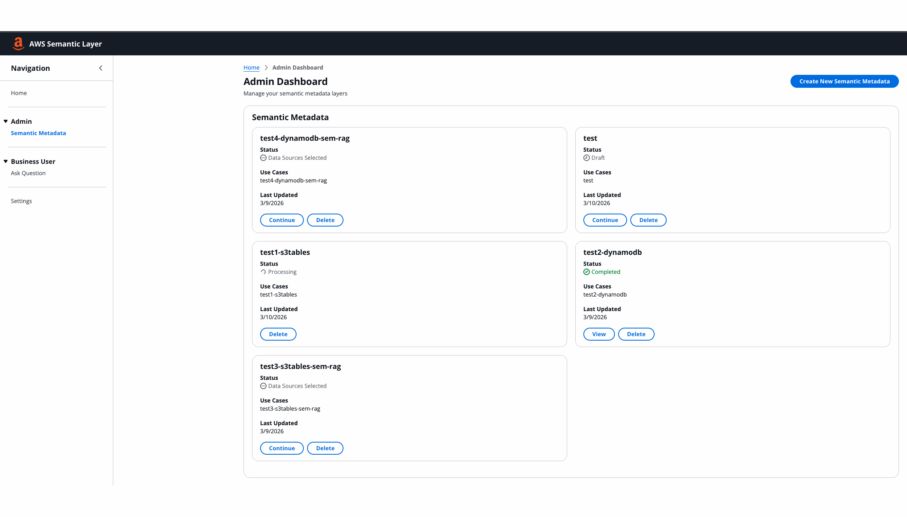
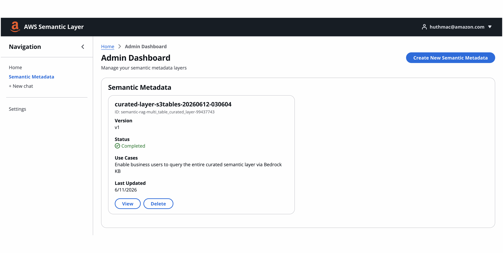
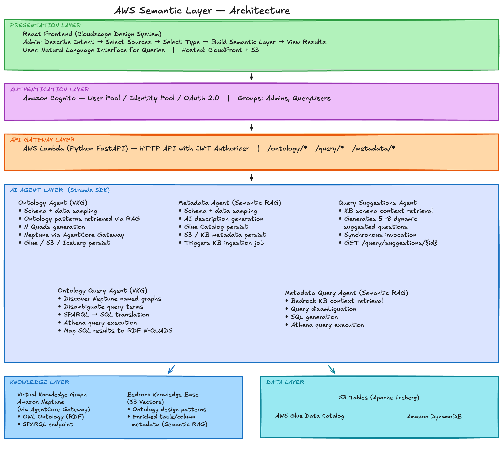

# Sample Semantic Layer for Structured Data

## Overview

This project enables the implementation of two alternative semantic layer approaches for structured data:

1. **Virtual Knowledge Graph (VKG)**: OWL ontology stored in Amazon Neptune; natural language queries are translated to SQL via ontology mappings
2. **Semantic RAG**: Semantic metadata stored in Amazon Bedrock Knowledge Base; natural language queries use RAG for context-aware SQL generation

Both approaches share the same admin workflow up to the point of choosing the semantic layer type.

### Key Capabilities

- **Dual Semantic Layer Modes**: Choose VKG (Neptune-based ontology) or Semantic RAG (Bedrock KB-based metadata)
- **AI-Powered Metadata Enrichment**: Automated descriptions for databases, tables, and columns written back to Glue Data Catalog
- **AI-Assisted Metadata Generation**: Versioned, iterative semantic layer creation with human in the loop
- **Natural Language Queries**: Query data across sources using plain English
- **Ontology in Neptune**: Business concepts, relationships, and mappings stored as RDF/OWL
- **Data in Source Systems**: Actual data remains in source systems
- **Query Translation**: AI agents use semantic layer to translate natural language into SQL/SPARQL queries

## Demo

### Virtual Knowledge Graph Flow



### Semantic RAG Flow



## Architecture



```
┌────────────────────────────────────────────────────────────────┐
│                      PRESENTATION LAYER                        │
│  React Frontend (Cloudscape Design)                            │
│  - Admin: Describe Intent → Select Sources → Select Type →     │
│           Build Semantic Layer → View Results                  │
│  - User: Natural Language Interface for Queries                │
│  Hosted: CloudFront + S3                                       │
└────────────────────────────────────────────────────────────────┘
                              ↓ HTTPS
┌────────────────────────────────────────────────────────────────┐
│                    AUTHENTICATION LAYER                        │
│  Amazon Cognito - User Pool / Identity Pool / OAuth 2.0        │
│  Groups: Admins, QueryUsers                                    │
└────────────────────────────────────────────────────────────────┘
                              ↓
┌────────────────────────────────────────────────────────────────┐
│                       API GATEWAY LAYER                        │
│  AWS Lambda (Python FastAPI) — HTTP API with JWT authorizer    │
│  Endpoints: /ontology/* /query/* /metadata/*                   │
└────────────────────────────────────────────────────────────────┘
                              ↓
┌────────────────────────────────────────────────────────────────┐
│                    AI AGENT LAYER (Strands)                    │
│  ┌──────────────────────┐  ┌──────────────────────────────┐    │
│  │ Ontology Agent (VKG) │  │ Metadata Agent (Semantic RAG)│    │
│  │ - Schema + data smpl │  │ - Schema + data sampling     │    │
│  │ - Ontology patterns  │  │ - Metadata generation        │    │
│  │ - N-Quads generation │  │ - S3/Glue/Icberg             │    │
│  │ - Neptune (via GW)   │  │                              │    │
│  │ - S3/Glue/Iceberg    │  │                              │    │
│  └──────────────────────┘  └──────────────────────────────┘    │
│  ┌──────────────────────┐  ┌──────────────────────────────┐    │
│  │ Ontology Query Agent │  │ Metadata Query Agent         │    │
│  │ - Neptune ontology   │  │ - Bedrock KB retrieval       │    │
│  │ - disambiguation     │  │ - disambiguation             │    │
│  │ - SPARQL→SQL transl. │  │ - SQL generation             │    │
│  │ - SQL generation     │  │ - Athena query               │    │
│  │ - Athena query       │  │                              │    │
│  │ - RDF result mapping │  │                              │    │
│  └──────────────────────┘  └──────────────────────────────┘    │
│  ┌──────────────────────────────────────────────────────┐      │
│  │ Query Suggestions Agent                              │      │
│  │ - KB schema context retrieval                        │      │
│  │ - Generates 5–8 dynamic suggested questions          │      │
│  └──────────────────────────────────────────────────────┘      │
└────────────────────────────────────────────────────────────────┘
           ↓                              ↓
┌──────────────────────┐    ┌────────────────────────────────────┐
│  KNOWLEDGE LAYER     │    │         DATA LAYER                 │
│                      │    │                                    │
│  Amazon Neptune      │    │  S3 Tables (Apache Iceberg)        │
│  - OWL Ontology      │    │  - Real-time CDC via DynamoDB      │
│  - Named Graphs      │    │    Streams + PyIceberg Lambda      │
│  - SPARQL endpoint   │    │    OR Glue Zero-ETL integrations   │
│    (via AC Gateway)  │    │                                    │
│                      │    │ AWS Glue Catalog / S3Table Metadata│
│                      │    │  - AI-enriched descriptions        │
│  Bedrock KB          │    │                                    │
│  - Ontology patterns │    │  Amazon Athena                     │
│  - Enriched table/   │    │  - Federated query engine          │
│    column metadata   │    │                                    │
│    (Semantic RAG)    │    │                                    │
└──────────────────────┘    └────────────────────────────────────┘
```

## Technology Stack

### Frontend

- **Framework**: React 18
- **UI Library**: AWS Cloudscape Design System 3.0
- **Authentication**: AWS Amplify Auth (Cognito)
- **HTTP Client**: Axios
- **Routing**: React Router v6
- **Hosting**: CloudFront + S3

### Backend & Infrastructure

- **Infrastructure as Code**: AWS CDK v2 (TypeScript)
- **API Layer**: AWS Lambda with Python FastAPI
- **AI Framework**: Strands Agents SDK
- **LLM**: Amazon Bedrock
- **Container Registry**: Amazon ECR
- **Agent Runtime**: Amazon Bedrock AgentCore Runtime (5 runtimes)

### Data & Knowledge Layer

- **Graph Database**: Amazon Neptune (RDF/SPARQL) — VKG mode
- **Vector Store**: Amazon Bedrock Knowledge Base (S3 Vectors)
- **Operational Data**: Amazon DynamoDB (12 insurance tables)
- **Analytical Data**: Amazon S3 Tables (Apache Iceberg format)
- **Real-Time CDC**: DynamoDB Streams → Lambda (PyIceberg) → S3 Tables
- **Batch Replication**: AWS Glue Zero-ETL integration
- **Normalized Views**: AWS Glue 5.1 Materialized Views (40 Iceberg MVs in `normalized` namespace)
- **Metadata Catalog**: AWS Glue Data Catalog (AI-enriched descriptions)
- **Query Engine**: Amazon Athena (with DynamoDB Connector + S3 Tables catalog)

### Security & Observability

- **Authentication**: Amazon Cognito (OAuth 2.0)
- **AI Safety**: Amazon Bedrock Guardrails
- **Observability**: AWS OpenTelemetry Distro
- **Secrets**: AWS Secrets Manager + Systems Manager Parameter Store
- **Network**: Lake Formation permissions for S3 Tables access control

## User Stories & Features

### Admin Flow

#### 1. Describe Application Intent

**Implementation**: `frontend/src/pages/admin/DescribeIntent.jsx`

- Text input for data source descriptions and business use cases
- Stores configuration in DynamoDB `semantic-layer-metadata` table

#### 2. Select Data Sources

**Implementation**: `frontend/src/pages/admin/SelectDataSources.jsx`

- Multi-select from Glue Catalog databases/tables (including S3 Tables/Iceberg)
- Optional file upload for existing ontology/documentation
- Each selected table includes its Athena `catalogId` for federated routing

#### 3. Review Metadata

**Implementation**: `frontend/src/pages/admin/ReviewMetadata.jsx`

- Read-only view of Glue Catalog metadata (tables, columns, data types)

#### 4. Select Semantic Layer Type ^1

**Implementation**: `frontend/src/pages/admin/SelectSemanticLayerType.jsx`

- **VKG**: Generates OWL ontology stored in Amazon Neptune and Amazon S3
- **Semantic RAG**: Generates AI metadata stored in Amazon Bedrock Knowledge Base and Amazon S3

#### 5a. Build Knowledge Graph (VKG path) ^1

**Implementation**: `frontend/src/pages/admin/BuildKnowledgeGraph.jsx`

- Triggers Ontology Agent via Lambda API
- Progress: extracting metadata → retrieving patterns → generating OWL → loading to Neptune

#### 5b. Build Semantic Metadata (Semantic RAG path)

**Implementation**: `frontend/src/pages/admin/BuildSemanticMetadata.jsx`

- Triggers Metadata Agent via Lambda API
- Progress polling: per-table status with `tablesProcessed / totalTables`
- Agent writes descriptions to Glue Catalog and saves Markdown docs to S3/KB

#### 6. View Results

- **VKG** : `frontend/src/pages/admin/ViewKnowledgeGraph.jsx` — graph visualization ^1
- **Semantic RAG**: `frontend/src/pages/admin/ViewSemanticRAGMetadata.jsx` — enriched metadata view

^1 Optional: If "enableOntologyAgents": false, then this screen is disabled and SemanticRAG is selected as default

### End User Flow (Querying)

#### Natural Language Query

**Implementation**: `frontend/src/pages/query/NaturalLanguageQuery.jsx`

- Single input field; routes to correct query agent based on ontology type
- **VKG**: Ontology Query Agent translates via Neptune mappings → SQL → Athena
- **Semantic RAG**: Metadata Query Agent retrieves KB context → generates SQL → Athena
- Reasoning steps shown for transparency
- **Dynamic Suggested Questions**: selecting a semantic layer automatically calls `GET /query/suggestions/{id}` to fetch 5–8 AI-generated questions from the Query Suggestions Agent; displayed with category labels and a "Try this" affordance

## Data Sources

### 1. DynamoDB - Operational Data (12 tables)

`HOLDING`, `PARTY`, `COVERAGE`, `RIDER`, `RELATION`, `FINANCIALACTIVITY`, `FINANCIALSTATEMENT`, `POLICYPRODUCT`, `COVERAGEPRODUCT`, `INVESTPRODUCT`, `TYPE_CODES`, `ADMIN_CODES`

**Access**: Athena with DynamoDB Connector (`lambda:` catalog) or direct DynamoDB reads

### 2. S3 Tables (Apache Iceberg) - Analytical Data

**Real-time CDC pipeline** ^2

```
DynamoDB Streams → Lambda (PyIceberg) → S3 Tables (Iceberg)
                                         ↑
                   Glue Zero-ETL (batch) ─┘
```

- Sub-second latency via DynamoDB Streams + Lambda
- True schema evolution via Iceberg spec
- UPSERT/DELETE support via PyIceberg atomic operations
- Registered as `s3tablescatalog` catalog in Athena
- Governed via Lake Formation

^2 Optional: Enabled if "enableRealtimeReplication": true

**Batch pipeline** ^3

```
DynamoDB table → Zero-ETL integration → S3 Tables (zetl_<uuid> namespace)
                                                  ↓
                                        Glue 5.1 Materialized Views
                                                  ↓
                                        S3 Tables (normalized namespace)
                                        └─ 40 entity tables (holding, party,
                                           coverage, rider, relation, ...)
```

- Glue Zero-ETL integration per DynamoDB table → S3 Tables (`zetl_<uuid>` namespace per integration)
- **NormalizedViewsStack**: Glue 5.1 PySpark job creates 40 Iceberg Materialized Views in a `normalized` namespace, applying `sk LIKE '<Prefix>#%'` filters to demultiplex each flat Zero-ETL table into its constituent entity tables
- Scheduled refresh every 6 hours via EventBridge; incremental Iceberg refresh where possible
- `zetl_*` namespaces are internal replication staging — the `normalized` namespace is the user-facing analytical layer

^3 Optional: Enabled if "enableBatchReplication": true

## AI Agents (Strands Framework)

### 1. Ontology Generation Agent (VKG)

**Location**: `agents/ontology_agent/main.py`

**Purpose**: Generates OWL ontologies from Glue schemas and table sampling using user-provided documentation and sample ontology patterns retrieved via RAG from Bedrock KB.

**Three sub-agents**: Phase 1 (per-table N-Quads), Phase 2 (FK refinement + Neptune persist), Revision (targeted edits)

**Phase 1 tools** (per-table, fresh agent per table):

```python
get_single_table_schema(database_name, table_name, catalog_id)  # Athena DESCRIBE + Glue fallback
sample_table_data(database_name, table_name, catalog_id)        # Athena SELECT + DynamoDB fallback
retrieve_ontology_patterns(schema_description, max_patterns)    # RAG from Bedrock KB
download_document_from_s3(s3_path)                             # download reference docs
search_document(file_path, search_term, context_lines)
read_document_lines(file_path, start_line, num_lines)
append_nquads(ontology_id, table_name, nquad_batch)            # batched N-Quad writing (≤70 lines)
save_intermediate_ontology(ontology_id, table_name, ...)       # finalize + S3 save
update_progress(ontology_id, tables_processed, total_tables, current_table)
```

**Phase 2 tools** (per-table, fresh agent per table):

```python
append_fk_triples(ontology_id, table_name, fk_nquads)         # add FK ObjectProperty triples
persist_file_to_neptune(ontology_id, table_name)               # read file → AgentCore GW → Neptune
update_glue_metadata_from_ontology(ontology_id, database_name, table_name, catalog_id)
```

**Assembly** (Python, not agent): concatenate all per-table N-Quads → save consolidated `ontology.nq` to S3

**Post-assembly**: write Iceberg column doc strings + table descriptions to S3 Tables metadata via pyiceberg

**Revision tools**: `download_document_from_s3`, `search_document`, `read_document_lines`, `apply_targeted_edits`, `persist_revision_from_s3`

**Output**: N-QUADS in Neptune named graphs (via AgentCore Gateway) with `mapsToTable`/`mapsToColumn` traceability predicates; column descriptions written to Glue Data Catalog and Iceberg S3 metadata.

### 2. Metadata Generation Agent (Semantic RAG)

**Location**: `agents/metadata_agent/main.py`

**Purpose**: Create semantic metadata and save it in Glue Catalog, S3 Table metadata, and as markdown metadata documents to S3 for Bedrock KB ingestion. Supports two operational modes: **standard enrichment** and **annotation-only revision**.

**Tools** (shared by both modes):

```python
get_single_table_schema(database_name, table_name, catalog_id)
sample_table_data(database_name, table_name, catalog_id)
download_document_from_s3(s3_path)
search_document(file_path, search_term, context_lines)
read_document_lines(file_path, start_line, num_lines)
update_glue_table_metadata(database_name, table_name, table_description, column_descriptions, catalog_id)
update_glue_database_description(database_name, description)
save_metadata_document_to_s3(database_name, table_name, catalog_id, metadata_content)
update_progress(job_id, tables_processed, total_tables, current_table)
```

**Standard enrichment workflow** (per table, fresh agent per table):

1. For each unique database: write AI description to Glue
2. For each table: DESCRIBE schema → sample data (+ reference docs if uploaded) → generate descriptions → write to Glue & S3 Table Metadata → save Markdown to S3 → update progress
3. After all tables: trigger Bedrock KB ingestion job
4. Returns immediately (async); status polled via `jobId` in DynamoDB

**Annotation mode** (`ANNOTATION_SYSTEM_PROMPT`): Triggered when `annotations` are included in the enrichment payload. Skips data sampling and reference docs. Reads existing Glue descriptions as baseline, applies targeted per-column/per-table annotation hints, leaves all non-targeted descriptions unchanged, and rewrites the S3 Knowledge Base document.

**Versioning** (pointer + history pattern): Mirrors the ontology agent. When `revisionMode=True`:

1. Service stamps v1 with `revisionMode`, `targetVersion` (e.g. `v2`), and `revisionInstructions`
2. Agent runs enrichment/annotation as normal
3. On completion: `_write_versioned_completion()` writes an immutable history record (SK = `v2`) then updates v1 as the mutable current pointer (`currentVersion = v2`, `revisionMode = False`)

**Federated catalog routing**: The `catalogId` per table (e.g. `s3tablescatalog/<bucket>`) is resolved automatically. For S3 Tables, `versionToken` is fetched from the S3 Tables API on Glue update conflicts (retry-on-exception pattern).

### 3. Ontology Query Agent (VKG)

**Location**: `agents/ontology_query_agent/main.py`

**Tools**: `discover_named_graphs`, `get_ontology_from_neptune`, `disambiguate_query_terms`, `execute_athena_query`, `map_sql_results_to_rdf`

**Workflow**: Neptune → disambiguate → generate SQL → Athena → RDF N-QUADS → STOP

**Dynamic row limits**: default 10, user-specified (e.g. "top 30"), max 100.

### 4. Metadata Query Agent (Semantic RAG)

**Location**: `agents/metadata_query_agent/main.py`

**Purpose**: Retrieves enriched metadata from Bedrock KB, generates SQL, executes on Athena.

**Tools**: `retrieve_kb_context`, `generate_sql_query`, `execute_sql_query`

### 5. Query Suggestions Agent

**Location**: `agents/query_suggestions_agent/main.py`

**Purpose**: Generates 5–8 dynamic, contextually relevant suggested questions for the Natural Language Query UI by retrieving schema context from the Bedrock Knowledge Base for the selected semantic layer.

**Tools**:

```python
retrieve_kb_context(user_query)   # retrieves schema docs from Bedrock KB (top 10 results)
```

**Workflow**:

1. Receives `{"id": "<ontology_config_id>"}` payload from AgentCore entrypoint
2. Looks up the metadata config name from DynamoDB
3. Agent calls `retrieve_kb_context("list all available tables and their columns and business purpose")`
4. LLM analyses schema context and generates 5–8 categorised questions
5. Returns `{"suggestions": [{"category": "...", "question": "..."}, ...]}`

**Invocation**: Synchronous — no polling required. Called via `GET /query/suggestions/{ontology_id}`.

## CDK Infrastructure (TypeScript)

### Stack Architecture (17 stacks)

```
1.  semantic-layer-networking
    └─> VPC, Subnets, Security Groups, VPC Endpoints

2.  semantic-layer-dynamodb
    └─> 12 insurance tables + metadata table + synthetic data loader

3.  semantic-layer-glue-catalog
    └─> Depends on: dynamodb
    └─> DynamoDB Glue database + crawler; Iceberg Glue database

4.  semantic-layer-data-lake
    └─> Depends on: glue-catalog
    └─> S3 Tables bucket (Iceberg), artifacts bucket, athena results,
        KB bucket, logging bucket; Lake Formation grants

5.  semantic-layer-stream-processor  [enableRealtimeReplication=true]
    └─> Depends on: dynamodb, data-lake
    └─> DynamoDB Streams → Lambda (PyIceberg) → S3 Tables CDC pipeline
        DLQ, per-table stream processors, backfill Lambda

6.  semantic-layer-zeroetl  [enableBatchReplication=true]
    └─> Depends on: dynamodb, data-lake
    └─> 12 Glue Zero-ETL integrations: DynamoDB table → S3 Tables
        (each integration creates a zetl_<uuid> namespace)

7.  semantic-layer-normalized-views  [enableBatchReplication=true]
    └─> Depends on: zeroetl, data-lake
    └─> Glue 5.1 PySpark job: 40 Iceberg Materialized Views in
        'normalized' S3 Tables namespace; EventBridge 6h refresh schedule
        IAM role + LF grants on all zetl_* namespaces + normalized

8.  semantic-layer-neptune  [enableOntologyAgents=true]
    └─> Depends on: networking
    └─> Neptune cluster (RDF/SPARQL) in VPC

9.  semantic-layer-bedrock-kb
    └─> Depends on: data-lake
    └─> OpenSearch Serverless + Knowledge Base; dual use:
        ontology patterns (VKG) + enriched metadata (Semantic RAG)

10. semantic-layer-athena
    └─> Depends on: data-lake, glue-catalog, dynamodb, networking
    └─> Workgroup, DynamoDB connector, Lake Formation admin chain

11. semantic-layer-agentcore
    └─> Depends on: neptune, bedrock-kb, glue-catalog, athena, data-lake
    └─> 5 AgentCore Runtimes + ECR repo + Neptune Gateway construct
        LF SELECT grants on normalized namespace (when enableBatchReplication=true)

12. semantic-layer-agentcore-eval
    └─> Depends on: agentcore
    └─> Online evaluation configs (sampling rate 100%) for all 5 AgentCore runtimes

13. semantic-layer-cloudfront-storage
    └─> Depends on: data-lake
    └─> CloudFront distribution + S3 website bucket + OAC

14. semantic-layer-auth
    └─> Depends on: cloudfront-storage
    └─> Cognito User Pool, Identity Pool, OAuth 2.0

15. semantic-layer-guardrails
    └─> Bedrock Guardrails (content filters + PII detection)

16. semantic-layer-lambda-api
    └─> Depends on: auth, data-lake, dynamodb, agentcore
    └─> FastAPI Lambda + HTTP API Gateway (JWT) + Lake Formation grants

17. semantic-layer-frontend
    └─> Depends on: cloudfront-storage, auth, lambda-api
    └─> React build + S3 sync + CloudFront invalidation

```

### Stack Details

#### DynamoDB Stack (`dynamodb-stack.ts`)

- 12 insurance domain tables with DynamoDB Streams enabled (NEW_AND_OLD_IMAGES)
- `semantic-layer-metadata` table for ontology/metadata job tracking
- Synthetic data loader Lambda

#### Data Lake Stack (`data-lake-stack.ts`)

- **S3 Tables bucket**: Apache Iceberg tables (replaces plain Parquet)
- **Artifacts bucket**: Ontologies (Turtle), metadata documents (Markdown)
- **Athena results bucket**: Query result storage with 7-day lifecycle
- **Knowledge Base bucket**: Source docs for Bedrock KB
- **Lake Formation**: Grants for stream processor, Athena execution role, agent roles
- Exports `lfGrantSingletonRoleArn` to preserve LF admin chain across stacks

#### Glue Catalog Stack (`glue-catalog-stack.ts`)

- `insurance_dynamodb` database: DynamoDB tables via crawler
- `insurance_iceberg` database: S3 Tables (Iceberg) namespace
- Auto-starts DynamoDB crawler on deployment

#### DynamoDB Stream Processor Stack (`dynamodb-stream-processor-stack.ts`)

- Per-table Lambda functions consuming DynamoDB Streams
- Writes to S3 Tables via PyIceberg (ARM64 Docker container)
- SQS Dead Letter Queue with 14-day retention
- Backfill Lambda for initial data load
- CodeBuild (ARM64) for container image build and push

#### Zero-ETL Stack (`zeroetl.ts`)

- 12 Glue Zero-ETL integrations — one per DynamoDB source table → S3 Tables
- Each integration creates a `zetl_<uuid>` namespace in the S3 Tables bucket
- Multiple deployments create multiple UUID namespaces; the NormalizedViewsStack job dynamically discovers the newest per source table at runtime
- Managed batch replication as alternative to the real-time stream processor

#### Normalized Views Stack (`normalized-views-stack.ts`)

- **Glue 5.1 PySpark job** (`glue/create-normalized-views.py`): creates 40 Apache Iceberg Materialized Views in a `normalized` S3 Tables namespace from Zero-ETL source tables
- **Namespace discovery**: job discovers the most-recently-created `zetl_*` namespace per source table at runtime via `
- **Idempotent**: `CREATE MATERIALIZED VIEW IF NOT EXISTS` + `REFRESH MATERIALIZED VIEW` — safe to re-run
- **Spark conf**: S3Tables Glue catalog with `client.region` (required by `LakeFormationAwsClientFactory`) and `warehouse` (required by catalog plugin initialisation)
- **EventBridge rule**: triggers job every 6 hours; incremental Iceberg refresh where possible
- **Lake Formation**: SELECT grants on all `zetl_*` namespaces (both current and historical); `AwsCustomResource` pre-creates `normalized` namespace at deploy time so LF `CREATE_TABLE` grant succeeds

#### AgentCore Stack (`agentcore-stack.ts`)

- **5 AgentCore Runtimes**: `ontology`, `query` (VKG), `metadata`, `metadata-query` (Semantic RAG), `query-suggestions`
- **Feature flag**: VKG-related resources (ontology runtime, query runtime, Neptune Gateway) are conditionally deployed only when both `neptuneStack` and `bedrockKbStack` are provided — allows deploying in Semantic RAG-only mode
- **AgentCore Neptune Gateway**: HTTP gateway construct enabling agents to access Neptune without VPC
- Shared ECR repository; CodeBuild (ARM64) per agent
- IAM roles with least-privilege per agent type
- Lake Formation permissions for Iceberg table access

#### Lambda REST API Stack (`lambda-rest-api/index.ts`)

- FastAPI container on Lambda; sub-apps mounted at `/ontology`, `/datasource`, `/query`, `/metadata`, `/neptune`
- **Dedicated DynamoDB table** (`semantic-layer-query-results`) for async query tracking (status + S3 result key, TTL-enabled)
- **Endpoints**:
  - `POST /ontology/config` — create/update ontology config
  - `GET /ontology/config/{ontology_id}` — get config
  - `GET /ontology/list` — list all configs
  - `DELETE /ontology/config/{ontology_id}` — delete config
  - `POST /ontology/build/{ontology_id}` — trigger Ontology Agent (VKG)
  - `GET /ontology/build-status/{ontology_id}` — poll build progress
  - `GET /ontology/versions/{ontology_id}` — list ontology version history
  - `GET /ontology/content/{ontology_id}/{version_id}` — retrieve version content
  - `POST /ontology/revise/{ontology_id}/{version_id}` — start versioned ontology revision
  - `POST /ontology/upload` — upload reference document
  - `POST /metadata/enrich` — trigger Metadata Agent (Semantic RAG); accepts optional `annotations` for annotation-only mode
  - `GET /metadata/enrich/status/{job_id}` — poll enrichment progress
  - `POST /metadata/revise/{id}/{version_id}` — start versioned metadata revision (pointer + history pattern)
  - `POST /metadata/query/submit` — submit Semantic RAG natural language query (async)
  - `GET /metadata/query/status/{query_id}` — poll metadata query status
  - `GET /metadata/query/result/{query_id}` — retrieve metadata query result
  - `GET /metadata/table/{database_name}/{table_name}` — get AI-enriched KB metadata for a single table
  - `POST /query/submit` — submit VKG natural language query (async)
  - `GET /query/result/{query_id}` — retrieve VKG query result
  - `GET /query/status/{query_id}` — poll VKG query status
  - `GET /query/suggestions/{ontology_id}` — AI-generated suggested questions (synchronous)
- **Bedrock Guardrails** integration: `GuardrailService` pre-screens user inputs (INPUT) before AgentCore invocation and post-screens agent answers (OUTPUT) before storage; blocked queries return `BLOCKED` status with the guardrail's canned message
- `GUARDRAIL_IDENTIFIER` and `GUARDRAIL_VERSION` injected as Lambda environment variables; `bedrock:ApplyGuardrail` IAM permission scoped to the guardrail resource
- Carries forward Lake Formation admin chain (networking, athena, agent roles)

## Data Flow Workflows

### Workflow 1: Semantic RAG Metadata Enrichment

```
1. Admin selects tables (including S3 Tables with catalogId)
2. Admin selects "Semantic RAG" type
3. Frontend → POST /metadata/enrich → Lambda → AgentCore Metadata Runtime

4. Metadata Agent (async background, per-table fresh agent):
   a. update_glue_database_description(db, description)
   b. For each table:
      - get_single_table_schema(db, table, catalogId)  ← Athena DESCRIBE (catalog-aware)
      - sample_table_data(db, table, catalogId)         ← live sample rows
      - [if uploaded docs] download_document_from_s3 + search/read
      - [if annotations] apply targeted hints via ANNOTATION_SYSTEM_PROMPT
      - Compose table + column descriptions
      - update_glue_table_metadata(...)    ← write back to Glue
      - save_metadata_document_to_s3(...)  ← Markdown to artifacts bucket
      - update_progress(jobId, ...)        ← DynamoDB tracking
   c. _trigger_kb_ingestion()              ← start Bedrock KB sync job

5. Frontend polls GET /metadata/enrich/status/{jobId} every 5s
6. On completion: Admin views enriched metadata in ViewSemanticRAGMetadata

Revision flow (versioned re-enrichment):
  POST /metadata/revise/{id}/{version} → MetadataService.start_metadata_revision()
    → stamps v1: revisionMode=True, targetVersion=vN, revisionInstructions
    → invokes metadata agent (annotation mode)
    → on completion: _write_versioned_completion() writes immutable vN history record
      + updates v1 pointer (currentVersion=vN, revisionMode=False)
```

### Workflow 2: VKG Ontology Generation

```
1. Admin selects tables, selects "VKG" type
2. Ontology Agent:
   a. get_database_tables(database)
   b. For each table:
      - get_single_table_schema(database, table)
      - retrieve_ontology_patterns(description) → Bedrock KB
      - Generate N-QUADS with mapsToTable/mapsToColumn predicates
      - persist_to_neptune(nquads)         ← via AgentCore Neptune Gateway
      - save_ontology_to_s3(turtle, name)
3. Admin views knowledge graph visualization
```

### Workflow 3: Natural Language Query

```
VKG path:
  User query → [Guardrail INPUT screen] → Ontology Query Agent → Neptune (SPARQL)
  → disambiguate → generate SQL → Athena → RDF N-QUADS → summary
  → [Guardrail OUTPUT screen] → store to S3 → return to frontend

Semantic RAG path:
  User query → [Guardrail INPUT screen] → Metadata Query Agent → Bedrock KB (retrieve context)
  → generate SQL → Athena → summary
  → [Guardrail OUTPUT screen] → store to S3 → return to frontend

Blocked queries: status=BLOCKED, canned guardrail message returned, no agent invoked
```

### Real-Time CDC Pipeline

```
DynamoDB write → DynamoDB Stream → Lambda (PyIceberg)
  → S3 Tables (Iceberg) UPSERT/DELETE
  → Glue Catalog (auto-updated)
  → Athena queryable immediately

Glue Zero-ETL batch path (alternative):
  DynamoDB → Zero-ETL Integration → S3 Tables (zetl_<uuid> namespace)
                                          ↓ Glue 5.1 MV job (every 6h)
                                    S3 Tables (normalized namespace)
                                    40 entity MVs — SELECT * WHERE sk LIKE '...'
                                    → Athena queryable via normalized.*
```

## Project Structure

```
semantic-layer/
├── cdk/                          # AWS CDK Infrastructure (TypeScript)
│   ├── bin/
│   │   └── app.ts               # CDK app entry point — 17 stacks
│   └── lib/
│       └── stacks/
│           ├── backend/
│           │   ├── networking-stack.ts
│           │   ├── dynamodb-stack.ts
│           │   ├── glue-catalog-stack.ts
│           │   ├── data-lake-stack.ts
│           │   ├── dynamodb-stream-processor-stack.ts
│           │   ├── neptune-stack.ts
│           │   ├── bedrock-kb-stack.ts
│           │   ├── athena-stack.ts
│           │   ├── agentcore-stack.ts
│           │   ├── agentcore-eval-stack.ts
│           │   ├── agentcore/
│           │   │   └── neptune-gateway-construct.ts
│           │   ├── zeroetl.ts
│           │   ├── normalized-views-stack.ts
│           │   ├── auth/index.ts
│           │   ├── guardrails/index.ts
│           │   └── lambda-rest-api/index.ts
│           └── frontend/
│               ├── index.ts
│               ├── cloudfront-storage.ts
│               └── provider.ts
│
├── agents/                       # Strands AI Agents (Python)
│   ├── ontology_agent/
│   │   ├── main.py              # VKG ontology generation agent
│   │   ├── prompt_builder.py    # Namespace + prompt construction
│   │   └── token_manager.py
│   ├── ontology_query_agent/
│   │   ├── main.py              # VKG natural language query agent
│   │   └── token_manager.py
│   ├── metadata_agent/
│   │   ├── main.py              # Semantic RAG metadata enrichment agent
│   │   ├── prompt_builder.py    # System prompts + build_table_prompt / build_annotation_prompt
│   │   └── token_manager.py
│   ├── metadata_query_agent/
│   │   ├── main.py              # Semantic RAG natural language query agent
│   │   └── token_manager.py
│   ├── query_suggestions_agent/
│   │   ├── main.py              # Dynamic query suggestions agent (synchronous)
│   │   ├── query_prompts.py     # System prompt + model specification
│   │   └── token_manager.py
│   ├── Dockerfile.ontology
│   ├── Dockerfile.ontologyquery
│   ├── Dockerfile.metadata
│   ├── Dockerfile.metadataquery
│   ├── Dockerfile.querysuggestions
│   └── requirements.txt
│
├── glue/
│   └── create-normalized-views.py  # Glue 5.1 PySpark job — 40 Iceberg MVs
│
├── lambda/
│   ├── rest-api/                # FastAPI application
│   │   ├── main.py              # app entry point — mounts sub-apps
│   │   ├── metadata_api.py
│   │   ├── ontology_api.py
│   │   ├── query_api.py
│   │   ├── datasource_api.py
│   │   ├── neptune_api.py
│   │   └── services/
│   │       ├── agentcore_service.py
│   │       ├── glue_service.py
│   │       ├── guardrail_service.py  # Bedrock Guardrails INPUT/OUTPUT screening
│   │       ├── metadata_service.py
│   │       ├── neptune_service.py
│   │       ├── ontology_service.py
│   │       └── query_service.py
│   └── dynamodb-stream-processor/  # PyIceberg CDC Lambda
│
├── frontend/                     # React Frontend
│   └── src/
│       ├── pages/
│       │   ├── admin/
│       │   │   ├── AdminDashboard.jsx
│       │   │   ├── DescribeIntent.jsx
│       │   │   ├── SelectDataSources.jsx
│       │   │   ├── SelectSemanticLayerType.jsx
│       │   │   ├── ReviewMetadata.jsx
│       │   │   ├── BuildKnowledgeGraph.jsx      # VKG path
│       │   │   ├── BuildSemanticMetadata.jsx    # Semantic RAG path
│       │   │   ├── ViewKnowledgeGraph.jsx
│       │   │   └── ViewSemanticRAGMetadata.jsx
│       │   └── query/
│       │       ├── NaturalLanguageQuery.jsx
│       └── services/
│           └── api.js
│
└── scripts/
    ├── generate_complete_synthetic_data.py
    ├── load_to_dynamodb.py
    └── convert-ontologies.py
```

## Deployment Instructions

### Prerequisites

1. **AWS Account** with administrator access
2. **AWS CLI** configured with credentials
3. **Node.js** 18+ and npm
4. **Docker** for building agent container images
5. **AWS CDK** CLI v2+
6. **Python** 3.12+

### Environment Setup

```bash
npm install -g aws-cdk
cdk --version
```

### CDK Bootstrap

```bash
cdk bootstrap aws://ACCOUNT-ID/REGION
```

### Install and Deploy

```bash
# Install CDK dependencies
cd cdk && npm install && npm run build

# Deploy all 17 stacks
cdk deploy --all
```

Deployment takes approximately 40-60 minutes (includes CodeBuild jobs for ARM64 container images).

### Post-Deployment

1. **Create Cognito Users**: Get User Pool ID from CDK outputs, create admin user and add to `Admins` group
2. **Upload Ontology Patterns**: Copy VKG design patterns to the Bedrock KB source bucket and trigger ingestion (if using VKG mode)
3. **Access Application**: Get CloudFront URL from stack outputs

## Security Considerations

### Authentication & Authorization

- Cognito User Pool with OAuth 2.0 + PKCE
- User Groups: `Admins` (ontology management), `QueryUsers` (queries only)
- JWT tokens (1-hour expiry) validated at API Gateway

### Network Security

- Neptune in private VPC subnets, accessed via AgentCore Neptune Gateway (no public endpoint)
- AgentCore agents access all other services via public AWS endpoints (no VPC required)
- CloudFront DDoS protection; API Gateway rate limiting

### Data Security

- S3 Tables governed by AWS Lake Formation (fine-grained access control)
- All S3 buckets encrypted (SSE-S3); DynamoDB encrypted at rest
- Secrets Manager for sensitive configuration; Parameter Store for endpoints
- IAM least-privilege roles per agent and per stack

### AI Safety

- **Bedrock Guardrails**: content filtering (sexual, violence, hate, insults, misconduct at HIGH strength), PII anonymization (address), denied topics (financial/legal advice), profanity word list
- **`GuardrailService`** in Lambda REST API applies guardrails on every natural language query:
  - **INPUT pre-screen**: user question evaluated before invoking any agent (fail-fast — saves compute on blocked queries)
  - **OUTPUT post-screen**: agent answer evaluated before return
  - Blocked queries return `BLOCKED` status with guardrail's canned message; fail-open on `ApplyGuardrail` API errors
- CloudWatch logs for all agent invocations

## Cost Estimation (caution: AI generated & unverified)

The following table provides a sample cost breakdown for deploying this solution in the US East (N. Virginia) Region for one month.

### Assumptions

- 50 monthly active users (MAU)
- 5,000 Lambda invocations/month for the FastAPI REST API (avg 10s duration, 2048MB memory)
- 12,000 CDC stream processor Lambda invocations/month (12 tables × ~1K DynamoDB events each)
- 5 AgentCore Runtimes: 200 sessions/month total (avg 10 min each) = 2,000 runtime minutes
- Amazon Bedrock Claude Sonnet 4.6: ~8M input tokens, ~1M output tokens/month (5 agents + KB RAG)
- Amazon Neptune: db.t3.medium cluster, ~10 GB RDF/OWL storage (VKG mode)
- Amazon Bedrock Knowledge Base: 2 KBs (S3 Vectors backend) — ontology-patterns + semantic-rag; Titan Embed Text v2 embeddings; ~0.2 GB vector storage, ~500 queries/month
- DynamoDB: 13 tables (12 insurance + 1 metadata), on-demand capacity, ~5 GB storage, ~100K R/W operations
- S3: 6 buckets (website, artifacts, Athena results, KB source, logging, S3 Tables/Iceberg), ~50 GB total
- CloudFront: 5 GB data transfer out, 1M HTTPS requests/month
- Athena: 1,000 queries/month, ~50 GB scanned; DynamoDB connector (Lambda-based)
- Glue: 2 databases, 2 crawlers, 12 Zero-ETL integrations (DynamoDB → S3 Tables), 1 Glue 5.1 job (40 MVs, runs every 6h ~20 DPU-minutes per run)
- ECR: 7 container images (~15 GB total: 5 agents, FastAPI Lambda, CDC stream processor)
- CodeBuild: ARM64 builds — 7 images × ~5 builds/month × 20 min avg = ~700 build-minutes
- CloudWatch: 5 GB log ingestion/month across all agents, Lambda, and Neptune
- VPC: 1 NAT Gateway (Neptune private subnet) + VPC interface endpoints

| AWS Service                      | Dimensions                                                                                                                               | Cost [USD] |
| -------------------------------- | ---------------------------------------------------------------------------------------------------------------------------------------- | ---------- |
| AWS Lambda                       | FastAPI API (5K inv, 10s, 2048MB) + CDC stream processor (12K inv, 3s, 512MB) + misc                                                     | ~$3.00     |
| Amazon API Gateway               | HTTP API with JWT authorizer (Cognito), ~50K requests/month                                                                              | ~$0.10     |
| Amazon Bedrock AgentCore Runtime | 5 runtimes (ontology, ontology-query, metadata, metadata-query, query-suggestions), 200 sessions/month × 10 min avg = 2,000 minutes      | ~$40.00    |
| Amazon Bedrock (Models)          | Claude Sonnet 4.6 across all 5 agents: 8M input tokens, 1M output tokens/month                                                           | ~$39.00    |
| Amazon Neptune                   | db.t3.medium cluster (VKG mode), ~10 GB RDF/OWL storage, SPARQL endpoint in private VPC                                                  | ~$50.00    |
| Amazon Cognito                   | 50 MAU, Essentials tier with security features                                                                                           | ~$6.50     |
| Amazon DynamoDB                  | 13 tables (on-demand), 5 GB storage, ~100K R/W operations, Streams enabled for CDC                                                       | ~$2.50     |
| Amazon S3 & S3 Tables            | 6 buckets (website, artifacts, Athena results, KB source, logging) + S3 Tables (Apache Iceberg, 12 tables), ~50 GB total                 | ~$3.00     |
| Amazon CloudFront                | 5 GB data transfer out, 1M HTTPS requests/month                                                                                          | ~$1.00     |
| Amazon Bedrock Knowledge Base    | 2 KBs (S3 Vectors backend): ontology-patterns + semantic-rag; Titan Embed Text v2 embeddings; ~0.2 GB vector storage, ~500 queries/month | ~$5.00     |
| Amazon Athena                    | 1K queries/month, ~50 GB scanned; DynamoDB Connector (Lambda-based federated catalog)                                                    | ~$1.00     |
| AWS Glue                         | Data Catalog (2 databases, AI-enriched), 2 crawlers, 12 Zero-ETL integrations, Glue 5.1 job (40 MVs, 4×/day)                             | ~$10.00    |
| Amazon ECR                       | 7 container images: 5 AgentCore agents + FastAPI Lambda + CDC Lambda (~15 GB total)                                                      | ~$1.50     |
| AWS CodeBuild                    | ARM64 builds: 7 images × ~5 builds/month × 20 min avg (~700 build-minutes)                                                               | ~$5.00     |
| Amazon CloudWatch                | 5 GB log ingestion (agents, Lambda, Neptune), metrics, OpenTelemetry traces                                                              | ~$3.00     |
| AWS Secrets Manager              | 5 secrets (Neptune credentials, API keys, Bedrock config)                                                                                | ~$2.00     |
| Amazon VPC / NAT Gateway         | 1 NAT Gateway (Neptune private subnet), VPC interface endpoints                                                                          | ~$35.00    |
| Amazon Bedrock Guardrails        | Content filtering + PII detection/redaction, ~500 text units/month                                                                       | ~$1.00     |
| SSM Parameter Store              | Standard parameters (service endpoints, ARNs)                                                                                            | Free       |
| **Total (Moderate Usage)**       | **Monthly Cost for All Services**                                                                                                        | **~$209**  |

> **Note — Cost Drivers:** Amazon Neptune is the largest single cost (~$50/month for a db.t3.medium cluster). Amazon Bedrock AgentCore Runtime (5 runtimes, ~$40/month) and Bedrock model inference (Claude Sonnet 4.6, ~$39/month) are the next largest. The Knowledge Base backend uses **S3 Vectors** (not OpenSearch Serverless), keeping vector storage and query costs negligible (~$5/month for both KBs combined). For intermittent or dev/test VKG usage, Neptune Serverless can reduce the Neptune cost further.

## License

This library is licensed under the MIT-0 License. See the LICENSE file.

## Security

See [CONTRIBUTING](CONTRIBUTING.md#security-issue-notifications) for more information.

## Authors

- Felix Huthmacher, Senior Applied AI Architect [github - fhuthmacher](https://github.com/fhuthmacher)
