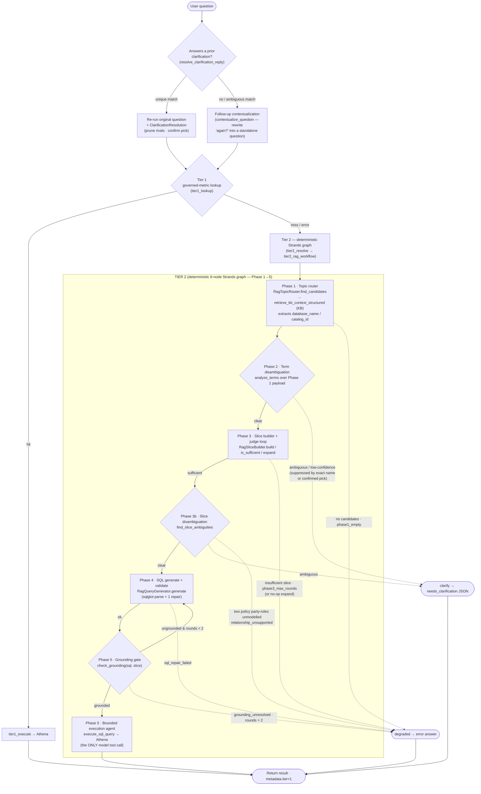

# Metadata Query Agent

This document describes the query resolution flow for the Metadata Query Agent (Semantic-RAG mode).

> **Why this doc exists.** It is easy to assume this agent is a free-form ReAct
> tool loop (`retrieve_kb_context → disambiguate_query_terms → execute_sql_query`),
> but **that is not how it works**. There is no agent-wide `SYSTEM_PROMPT` and no
> single-shot ReAct agent.
> The live agent resolves every question with a **two-tier cascade**: Tier 1
> governed-metric lookup, then a **deterministic Tier 2 Strands graph** of plain
> function calls. The only model-facing prompts on this path are `JUDGE_PROMPT`
> (Phase 3 slice judge) and `EXECUTION_PROMPT` (Phase 5 execution agent), both in
> [`query_prompts.py`](query_prompts.py). (The Phase 4 SQL-generation prompt is
> inline in `RagQueryGenerator`.) This doc makes the deployed flow explicit.

## Diagram

## Where the flow lives in code

| Step                             | Entry point                                                               | Module                                                                                            |
| -------------------------------- | ------------------------------------------------------------------------- | ------------------------------------------------------------------------------------------------- |
| Orchestration                    | `_run_query` → `_run_query_core`                                          | [`main.py`](main.py)                                                                              |
| Clarification resolution         | `load_pending_clarification` + `resolve_clarification_reply`              | [`../shared/clarification.py`](../shared/clarification.py)                                        |
| Tier 1 lookup                    | `tier1_lookup`                                                            | [`../shared/metric_lookup.py`](../shared/metric_lookup.py)                                        |
| Tier 1 execute                   | `tier1_execute` + `_build_response_from_metric`                           | [`../shared/metric_executor.py`](../shared/metric_executor.py) · [`main.py`](main.py)             |
| Tier 2 entry                     | `tier2_resolve` → `tier2_rag_workflow`                                    | [`main.py`](main.py) · [`tier2/workflow.py`](tier2/workflow.py)                                   |
| Tier 2 graph + shared primitives | `build_tier2_graph` · `WorkflowContext` · `PhaseDeps` · `run_tier2_graph` | [`tier2/workflow.py`](tier2/workflow.py) · [`../shared/tier2_graph.py`](../shared/tier2_graph.py) |

The deterministic phases (1, 2, 3, 3b, 4, and the grounding-gate half of 5) are
**not** LLM agents — they are plain Python functions wrapped by the `_FnNode`
adapter. They read and mutate a single shared `WorkflowContext` that node
functions and conditional-edge predicates both close over (Strands'
`GraphState` does not expose `invocation_state` to edge conditions, so this
shared-closure pattern is how data and routing flags flow between phases). Only
two phases invoke a model: the **Phase 3 slice judge** (`JUDGE_PROMPT`) and the
**Phase 5 bounded execution agent** (`EXECUTION_PROMPT`, the only phase that
calls `execute_sql_query`).

## Follow-up contextualization (before Tier 1/2)

The Tier 2 graph resolves a single **standalone** question (Phase 1 embeds it
into KB retrieval, Phase 2 tokenizes it), so a follow-up like _"again, how many
are there?"_ would reach the topic router with no antecedent.
`contextualize_question` ([`agents/shared/followup.py`](../shared/followup.py))
rewrites such follow-ups into self-contained questions using the chat session's
history **before** Tier 1 runs. Fail-soft: it returns the original question on a
first turn, a non-follow-up, or any error.

## Clarification resolution (before Tier 1/2)

When the **previous** assistant turn was a clarification (_"Which interpretation
of 'party' do you mean?"_), this turn's message is the user's **selection**, not
a new question. Before contextualization, `_run_query` loads the pending
clarification record off the last assistant turn (`load_pending_clarification`)
and matches the reply to exactly one offered option
(`resolve_clarification_reply`,
[`agents/shared/clarification.py`](../shared/clarification.py)):

- **On a unique match**, the agent re-runs the **original standalone question**
  (not the bare reply) and threads a `ClarificationResolution` into the Tier 2
  graph. Phase 1 prunes the **rival** candidates the user did not choose; Phase 2
  treats the **chosen** name as a confident binding (the `resolved_names` path
  in _Phase 2_ below). Multi-ambiguity chains accumulate earlier choices (`prior`) so each
  resolution does not re-open the previous one.
- **On no/ambiguous match**, resolution is `None` and the turn falls through to
  normal contextualization. If it is a re-ask of the **same** low-confidence
  question, the prior turn's options are carried forward so the re-ask stays
  stable (see Phase 2 below).

Fail-soft throughout: a missing/malformed record or non-unique reply never
breaks the turn — at worst it clarifies again.

## Tier 1 — Governed-metric lookup

**Entry point:** `_run_query` → `tier1_lookup`
([`main.py`](main.py) · `tier1_lookup`,
implemented in
[`agents/shared/metric_lookup.py`](../shared/metric_lookup.py)).

Tier 1 is the **first thing attempted for every question**. Its purpose is to
short-circuit the whole pipeline when the question maps cleanly to a
**published, governed metric** — a metric that already carries a vetted,
pre-compiled SQL definition. This is both the cheapest and the most
trustworthy path because the SQL was authored/reviewed up front rather than
generated by the model.

How it is invoked, step by step:

1. **Hydrate the KNN index** for the question's `namespace` from the
   `semantic-layer-metrics` DDB table. This is a no-op after the first call on a
   warm runtime; it is cheap on cold start because each namespace has at most a
   handful of `PUBLISHED` metrics.
2. **Embed the question** (Titan v2) and run a **KNN search** against the
   metrics index, pre-filtered server-side by `namespace` so a cross-namespace
   hit in the top-K cannot mask a real in-namespace match.
3. **Threshold check** — the top hit must clear a cosine-similarity threshold
   of **0.85** (`DEFAULT_THRESHOLD`). Below that, it is treated as a miss.
4. **Hydrate the metric** from DDB (`pk=NS#<namespace>`,
   `sk=METRIC#<id>`). If the KNN index references a metric that no longer
   exists in DDB (index drift), it is also treated as a miss.

**On a hit** (`metric is not None`):
the agent writes the step label `tier1_metric_hit`, runs `tier1_execute`
(which executes the metric's pre-compiled SQL on Athena), shapes the result via
`_build_response_from_metric` (stamped with `metadata.tier = 1`), and **returns
immediately**. Tier 2 is never reached.

**Fail-loud-but-degrade:** every Tier 1 failure mode — KNN unavailable, empty
index, below-threshold score, DDB drift, **or** a `tier1_execute` error — is
logged and falls through to Tier 2. A governed-metric problem must never 500
the request or block answering via the more general path.

## Tier 2 — Deterministic Strands graph (RAG progressive disclosure)

**Entry point:** `_run_query` → `tier2_resolve`
([`main.py`](main.py)), which builds a
`PhaseDeps` (router / builder / generator / `run_execution`) and runs
`tier2_rag_workflow` ([`tier2/workflow.py`](tier2/workflow.py)).

Tier 2 is reached **only when Tier 1 misses**. Its job is to build a **minimal,
sufficient schema slice** for the question and generate, ground, and execute
SQL from it — without dumping the entire catalog into the model's context. The
graph is a single linear-with-back-edges Strands `Graph` of six phase nodes
plus two no-op terminal sinks (`clarify`, `degraded`). Routing flags set on the
shared `WorkflowContext` (`degraded` / `needs_clarification` / `grounding_missing`)
steer each conditional edge.

### Phase 1 — Topic router (`RagTopicRouter.find_candidates`)

([`tier2/rag_topic_router.py`](tier2/rag_topic_router.py))

Calls `retrieve_kb_context_structured` against the namespace's Bedrock
Knowledge Base (scoped to the active `semantic_layer_id` + `semantic_layer_version`,
`top_k=20`). It returns **candidate `table_id`s ranked by retrieval score**,
de-duplicated. The full structured payload — including the **markdown chunk
body for each table** (`chunks_by_table`) and any `column_id` hits — is cached
on the router so later phases can parse it **without a second KB round-trip**.
Phase 1 also extracts the Athena `database_name` / `catalog_id` from the
top-ranked candidate (the `catalog_id` is **required** for federated catalogs
such as S3 Tables — without it Phase 5 execution hits `SCHEMA_NOT_FOUND`), and
builds the `kb_sources` citation list rendered in the UI's Knowledge Base
Sources panel.

**Optional reranking.** When `RERANK_MODEL_ID` is set (e.g.
`cohere.rerank-v3-5:0`), the Retrieve over-fetches a wider pool
(`RERANK_OVERFETCH`, default 50, capped at the API max of 100) and the Bedrock
reranker reorders it down to `top_k`, so the most **query-relevant** table docs
survive rather than the raw vector-similarity order. Empty (the default)
disables reranking.

**Candidate relevance floor.** The router drops candidates scoring below
`score_floor` **(0.10)** before they reach the slice, but always keeps the top
`min_candidates` **(8)** even when every score is weak. This prevents a long
tail of barely-related tables from being assembled into the slice and
overflowing the Phase 3 token budget (which would otherwise evict a
genuinely-needed but low-ranked table — see Phase 3).

If Phase 1 returns **no candidates**, the node sets `degraded = "phase1_empty"`
and the graph routes straight to the `degraded` terminal.

### Phase 2 — Term disambiguation (`analyze_terms`)

([`tier2/disambiguation.py`](tier2/disambiguation.py))

Analyzes the question's terms against the Phase 1 structured payload and records
term→table bindings on `ctx.disambiguation`. A **multi-token phrase pre-pass**
runs first: adjacent word pairs are concatenated (`coverage product` →
`coverage_product`/`coverageproducts`) and, when a phrase uniquely names one
table, both constituent terms are bound to it and removed from the per-term loop
— so a single term doesn't substring-match every same-suffix table and raise a
spurious clarification. Each remaining term is then matched to a candidate by
**exact name**, then by an **inflected name** (`inflection_variants` —
`parties`↔`party`, `addresses`↔`address`, `policies`↔`policy`), then by a
token/substring fallback. The inflection step matters: a naive `rstrip('s')`
turned `parties` into `partie` and silently failed to match the `party` table.

The node escalates to a `needs_clarification` payload
(`clarification_source = "phase2"`, routing to the `clarify` terminal) in three
cases, and **proceeds to Phase 3** otherwise:

- a term is **genuinely ambiguous** (maps to >1 distinct candidate table);
- the concept set spans **>1 database** (multi-domain) with no specific term;
- the top retrieval score is **below `DISAMBIG_SCORE_FLOOR` (0.4)**
  (`low_confidence`) **and** nothing lexical is trustworthy.

Two signals **suppress** the low-confidence clarification, because both are
stronger evidence than a modest cosine score:

1. **An exact (or inflected) table-name match** — if the head noun names a table
   by name, trust that binding. (This is why _"How many parties are there?"_ now
   resolves on the first turn even when `party` scores 0.34.)
2. **A user-confirmed pick** — when this turn answers a prior clarification, the
   chosen option names are passed in as `resolved_names`. A confirmed candidate
   is recorded as a CLEAR mapping (`source: 'clarification'`, confidence 1.0).
   This is essential: a low-confidence clarification is otherwise _unresolvable
   by picking_, since selecting a table can never raise its cosine score above
   the floor — without this the same question would re-clarify forever.

When a low-confidence clarification with **no specific term** does fire, its
options are the top candidate tables. On a **re-ask of the same question** the
node reuses the **previously-offered options** (`prior_clarification_options`,
rebuilt via `build_clarification_from_options`) instead of re-deriving them from
a fresh, non-deterministic retrieval — otherwise the user would see a _different_
set of candidates every turn and could never converge.

### Phase 3 — Slice builder + judge loop (`RagSliceBuilder`)

([`tier2/rag_slice_builder.py`](tier2/rag_slice_builder.py))

1. **`build`** parses the cached markdown chunk for each candidate table into a
   structured JSON slice — `tables`, `columns`, `joins`, `acord_paths`,
   `query_patterns`. There is **no Glue lookup** here; the slice comes entirely
   from the KB markdown, so Tier 2 RAG mode has **zero runtime dependency on the
   Glue catalog** (the catalog id only flows through to Phase 5 for Athena
   execution). Before assembling, `build` discovers **bridge tables**: a
   fetchable table that connects two otherwise-disconnected candidates (e.g.
   `holding` and `party` join only through `coverage`) is folded into the
   candidate set so the slice carries the transitive join path the SQL needs —
   otherwise the generator would invent a direct `holding.party_id` that the
   grounding gate then rejects. The serialized slice is fit to a **12,000-token
   budget** (`SLICE_TOKEN_BUDGET`) by `_fit`: joins are always kept (cheap and
   structurally critical), then **(a)** column _descriptions_ are stripped first
   — names+types are tiny and are all the judge/generator need, which alone
   usually fits a 20-table slice — and only if still over budget **(b)** whole
   columns are evicted **least-relevant-table first** (walking the router's
   relevance order in reverse), **never** evicting a discovered bridge. (This
   replaced the older lowest-degree eviction, which dropped exactly the
   answer-bearing leaf tables first.)
2. **`is_sufficient`** asks the **slice judge** (`JUDGE_PROMPT`, on Sonnet 4.6)
   whether the slice contains the tables/columns needed to answer the question.
   The judge returns `sufficient: true/false` and, when false, a `missing` list.
   The judge matches required tables on **table name only** and must **not**
   invent a schema/database qualifier from the question text — a user writing
   _"in the curated layer"_ must not make the judge demand `curated.party` when
   the slice carries `normalized.party`.
3. **`expand` loop** — while the judge says the slice is **insufficient** and
   the round count is **below `MAX_PHASE3_ROUNDS` (3)**, the builder folds the
   missing tables in (fetchable ones only) and re-judges. Three things end the
   loop early or correct it:
   - **Self-contradiction override** (deterministic, no LLM): if the judge says
     insufficient but **every** entry in `missing` is in fact present in the
     slice — by table/column name, ignoring any schema qualifier — the slice is
     authoritative and the loop proceeds to Phase 3b. This is the backstop for
     the `curated.party` false negative above. It fires only when `missing` is
     non-empty and **fully** present; a genuinely-absent table still degrades.
     (Mirrors the VKG agent's override.)
   - **No-op `expand` early-exit**: if `expand` cannot add any fetchable table
     (the judge named a table that doesn't exist in this layer, e.g. `payout` /
     `participant`), the rebuilt slice is byte-identical to the one just judged.
     Re-judging it would repeat the identical verdict, so the loop **bails to the
     degrade immediately** rather than spending the remaining rounds.
   - **Round ceiling**: if the judge is still unsatisfied at
     `MAX_PHASE3_ROUNDS`, the node sets `degraded = "phase3_max_rounds"`.

   On any `phase3_max_rounds` degrade the graph **short-circuits to the
   `degraded` terminal — it does NOT generate or execute SQL** against a slice
   the judge rejected (which would produce a misleading 0-row answer). The
   degrade message names the judge's unmet `missing` list so the user sees the
   genuine gap. The assembled slice + per-round judge verdicts
   (`judgeRoundsDetail`, including any `overrodeJudgeFalseNegative`) are emitted
   on the phase trace so the chat UI can view + download the grounding context
   and a degrade is diagnosable.

### Phase 3b — Slice disambiguation guard (`find_slice_ambiguities`)

([`tier2/slice_disambiguation.py`](tier2/slice_disambiguation.py))

A slice-level guard on the 3→4 edge. It does three things:

- **Heuristic resolution** — bindings the slice's own join graph disambiguates
  are merged into `ctx.disambiguation` for the Phase 4 generator.
- **Clarification** — a genuine slice-level collision (a needed column name
  present on >1 unconnected slice table) builds a `needs_clarification` payload
  (`clarification_source = "phase3b"`) and routes to the `clarify` terminal.
- **Unsupported-relationship fast-fail** — when the question compares two
  **distinct entity roles** (e.g. _insured_ vs _policyholder/owner_) but the
  slice cannot represent one of them, the node sets
  `degraded = "relationship_unsupported"` and routes to the `degraded` terminal
  with a **generated** (non-literal) message. The role vocabulary — which words
  name a role, which are synonyms, and the evidence tokens — is **derived at
  runtime** from the curated `columns[].description` role enumeration
  (`Values: Owner (synonyms: Policyholder), Insured, …`), not hard-coded; see
  `docs/plan/2026-06-26-delayer-slice-disambiguation-role-vocab-design.md`.

  Because the vocabulary and the representability evidence are derived from the
  **same** enumeration prose, any role the question can reference is necessarily
  representable, so for a slice whose only role evidence is that enumeration the
  guard does **not** fire — it degrades to a no-op when no enumeration is declared,
  and (with the B1 `life_participant` enrichment) lets the canonical "insured is
  also the policyholder" question proceed to the self-join instead of fast-failing.
  The grounding gate remains the backstop for genuinely unmodellable comparisons.

### Phase 4 — Query generator + SQL syntax check (`RagQueryGenerator.generate`)

([`tier2/rag_query_generator.py`](tier2/rag_query_generator.py))

Generates an **Athena SQL `SELECT`** from the final slice using a tightly
scoped Strands agent, then **validates the SQL syntax** before handing it off:

1. **Generate** SQL from the slice + question (plus any `grounding_feedback`
   fed back from a Phase 5 back-edge).
2. **Parse-only validation** — `validate_sql(sql, dialect="athena")`
   ([`tier2/sql_validator.py`](tier2/sql_validator.py))
   runs **`sqlglot.parse_one`** under the Athena dialect. This is _not_ full
   semantic validation (no schema/column checking); it catches the typos and
   stray-token failures an LLM tends to produce. A parse failure raises
   `SqlSyntaxError`.
3. **One repair round** (inside the generator) — on `SqlSyntaxError`, a fresh
   attempt is made with the parse error fed back into the prompt, and the result
   is validated again.
4. If the **second** validation also fails, the node sets
   `degraded = "sql_repair_failed"` and the graph routes to the `degraded`
   terminal.

> Note: this `sqlglot` parse check is the **only SQL syntax validation in the
> pipeline**. The Phase 5 execution agent does **not** pre-parse — it submits
> the query straight to Athena and surfaces / repairs any Athena-side error.

### Phase 5 — Grounding gate + bounded execution

([`tier2/grounding.py`](tier2/grounding.py) ·
[`tier2/execution_agent.py`](tier2/execution_agent.py))

Phase 5 runs in two halves:

1. **Grounding gate** (`check_grounding`, deterministic) — every table, column,
   join key, and literal in the generated SQL must appear in the slice. If a
   hallucinated identifier is found and `grounding_rounds < MAX_GROUNDING_ROUNDS`
   **(2)**, the node records the offending identifiers as `grounding_feedback`
   and loops **back to Phase 4** (regenerate SQL with the hallucinated names as a
   negative constraint). The back-edge targets Phase 4, **not** Phase 3: the
   slice was already judged sufficient, so the fix is to regenerate SQL using
   only real slice columns — widening the slice cannot conjure a column that
   genuinely does not exist. If the ceiling is hit, the node sets
   `degraded = "grounding_unresolved"` and routes to the `degraded` terminal.
2. **Bounded execution agent** (once grounded) — a tightly-scoped Strands agent
   whose only tool is `execute_sql_query`, prompted by `EXECUTION_PROMPT`. It
   runs the SQL on Athena, fixes Athena-side errors within a tight budget,
   re-checks zero-row results, and enforces the row contract: queries with no
   explicit `LIMIT` are rewritten to `LIMIT 101` so the executor can trim to
   **100 rows** (`ROW_CAP`) and flag `over_limit` / `total_row_count = ">100"`.
   **This is the only model tool call on the deployed path.**

The whole graph is bounded by `MAX_NODE_EXECUTIONS` **(40)** as a backstop
against runaway revisits; `reset_on_revisit(True)` lets Phase 4/5 re-enter
cleanly across the grounding back-edge.

## Result shaping & terminals

After the graph completes, `_run_query` reads the populated `WorkflowContext`:

- **Clarification** (`needs_clarification` set by Phase 2 / 3b) → returns the
  clarification JSON (with `n_quads = kb_sources`, `metadata.runtimeMs/usage`),
  and attaches a **pending-clarification record** (the original question + the
  offered options) so the next turn can resolve the user's selection (see
  _Clarification resolution_ above).
- **Degraded** (`phase1_empty`, `phase3_max_rounds`, `relationship_unsupported`,
  `sql_repair_failed`, `grounding_unresolved`, or any unexpected exception caught
  around `tier2_resolve`) → a plain error answer (with the phase's
  `degraded_detail` message where set), never a 5xx.
- **Success** → the executed SQL, columns/rows, the slice, KB sources, and usage
  totals, shaped to match the Tier 1 payload (`metadata.tier = 2`) so the
  frontend stays tier-agnostic.
