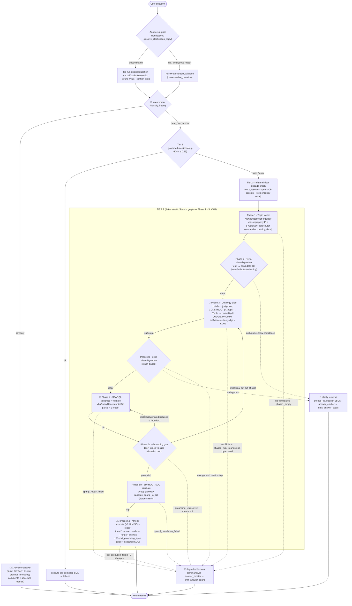

# Ontology Query Agent — Query Resolution Flow (VKG mode)

This document describes the Ontology Query Agent (VKG / Virtual Knowledge Graph
mode). It is the SPARQL/Ontop sibling of the
[`metadata_query_agent`](../metadata_query_agent/README.md) (Semantic-RAG mode):
same two-tier shape and shared graph primitives, but Tier 2 assembles an
**ontology slice**, generates **SPARQL**, and Phase 5 translates that SPARQL to
**SQL** (via Ontop) and runs it on **Athena**.

> Model-facing prompts exist in exactly these spots — everything else is
> deterministic Python:
>
> - **Intent router** (`_router_classify_fn`) and **advisory synthesis**
>   (`_advisory_synthesize`) — off the graph, before Tier 1.
> - In the Tier 2 graph: the **Phase 3 slice judge** (`tier2/slice_judge.py`),
>   the **Phase 4 SPARQL generator** (inline prompt in
>   `tier2/vkg_query_generator.py`), a conditional **Phase 5 SQL-repair** round
>   (`_REPAIR_PROMPT` in `main.py`), and the **Phase 5 answer renderer**
>   (`_render_answer`, `_ANSWER_PROMPT` in `main.py`) that turns the Athena result
>   into the user-facing sentence on the success path.

## Diagram

Nodes marked **📡** emit an OpenTelemetry span the AgentCore evaluation judges
harvest. A 🤖 marks a model (LLM) call; the SDK auto-instruments those as `chat`
spans, while 📡-only nodes emit a hand-rolled span via `emit_answer_span` /
`emit_grounding_span` (see [OTEL spans](#otel-spans--eval-telemetry)).



Note the two terminals (`CLAR`, `DEG`) emit their `emit_answer_span` **inside the
graph**, as the terminal node's body — that is the only OTEL context position the
SESSION harvester treats as the conversation's final answer (a post-graph emit
orphans into a separate trace).

## Where the flow lives in code

| Step                                 | Entry point                                                  | Module                                                                                                                    |
| ------------------------------------ | ------------------------------------------------------------ | ------------------------------------------------------------------------------------------------------------------------- |
| Orchestration                        | `_run_query` → `_run_query_core`                             | [`main.py`](main.py)                                                                                                      |
| Clarification resolution             | `load_pending_clarification` + `resolve_clarification_reply` | [`../shared/clarification.py`](../shared/clarification.py)                                                                |
| Follow-up contextualization          | `contextualize_question`                                     | [`../shared/followup.py`](../shared/followup.py)                                                                          |
| Intent router + advisory answer      | `classify_intent` · `build_advisory_answer`                  | [`../shared/advisory.py`](../shared/advisory.py) · [`main.py`](main.py)                                                   |
| Tier 1 lookup / execute              | KNN governed-metric lookup + Athena execute                  | [`../shared/metric_lookup.py`](../shared/metric_lookup.py) · [`main.py`](main.py)                                         |
| Tier 2 entry + phase deps            | `tier2_resolve` → `_build_phase_deps`                        | [`main.py`](main.py) · [`tier2/workflow.py`](tier2/workflow.py)                                                           |
| Graph + shared primitives            | `PhaseDeps` · `WorkflowContext` · `run_tier2_graph`          | [`tier2/workflow.py`](tier2/workflow.py) · [`../shared/tier2_graph.py`](../shared/tier2_graph.py)                         |
| Phase 1 topic router                 | `_GatewayTopicRouter` · `VkgTopicRouter`                     | [`tier2/vkg_topic_router.py`](tier2/vkg_topic_router.py)                                                                  |
| Phase 2 disambiguation               | `analyze_terms` (shared)                                     | [`../shared/disambiguation_common.py`](../shared/disambiguation_common.py)                                                |
| Phase 3 slice builder + judge        | `VkgSliceBuilder` · `build_slice_judge`                      | [`tier2/vkg_slice_builder.py`](tier2/vkg_slice_builder.py) · [`tier2/slice_judge.py`](tier2/slice_judge.py)               |
| Phase 3 CONSTRUCT / gateway          | `NeptuneConstruct` · typed MCP wrappers                      | [`tier2/neptune_construct.py`](tier2/neptune_construct.py) · [`tier2/gateway_client.py`](tier2/gateway_client.py)         |
| Phase 3b slice disambiguation        | `find_slice_ambiguities`                                     | [`tier2/slice_disambiguation.py`](tier2/slice_disambiguation.py)                                                          |
| Phase 4 SPARQL generate/validate     | `VkgQueryGenerator.generate` · `validate_sparql`             | [`tier2/vkg_query_generator.py`](tier2/vkg_query_generator.py) · [`tier2/sparql_validator.py`](tier2/sparql_validator.py) |
| Phase 5 grounding / translate / exec | `check_grounding` · `_run_execution` · `_repair_sql`         | [`tier2/grounding.py`](tier2/grounding.py) · [`main.py`](main.py)                                                         |

The deterministic phases (1, 2, 3b, the grounding + Ontop-translate + Athena
halves of 5) are **not** LLM agents — they are plain Python functions wrapped by
the `_FnNode` adapter, reading and mutating a single shared `WorkflowContext`
that node functions and conditional-edge predicates both close over. Four spots
**inside the graph** invoke a model — the **Phase 3 slice judge**, the **Phase 4
SPARQL generator**, a conditional **Phase 5 SQL-repair**, and the **Phase 5
answer renderer** (`_render_answer`, on the success path; it exists so Phase 5
emits a real `chat` span for the eval judges) — plus two **before** the graph:
the **intent router** and **advisory synthesis** (`../shared/advisory.py`).

## Invocation

- **Runtime:** AgentCore (`BedrockAgentCoreApp`), Python 3.12 container.
- **Entrypoint:** `invoke(payload, context=None)` in [`main.py`](main.py).
- **Payload:** `{id, question | message, sessionId, userId, turnId?}` where `id`
  is the `ontologyId`. The dispatcher routes on `turnId`: present →
  `_chat_stream()` (SSE AG-UI events); absent → `_run_query()` (direct JSON).
- **Returns:** on success `{answer, sql_query (the SPARQL lineage), results
(rows), n_quads, reasoning, metadata}`; on clarification `{needs_clarification:
true, options, clarification}`; on degrade a plain error answer (never a 5xx).

## Follow-up contextualization & clarification resolution (before Tier 1/2)

Identical in spirit to the RAG agent (the code is shared):

- **Follow-up contextualization** (`contextualize_question`,
  [`../shared/followup.py`](../shared/followup.py)) rewrites _"again, how many?"_
  into a standalone question using chat history before Tier 1 runs. Fail-soft.
- **Clarification resolution** — when the previous assistant turn was a
  clarification, this turn's message is the user's **selection**.
  `load_pending_clarification` + `resolve_clarification_reply`
  ([`../shared/clarification.py`](../shared/clarification.py)) match it to one
  offered option; on a unique match the agent re-runs the **original** question
  with a `ClarificationResolution` threaded into the graph (Phase 1 prunes the
  rivals, Phase 2 treats the chosen IRI as a confident binding). Fail-soft
  throughout.

## Tier 1 — Governed-metric lookup

The **first thing attempted for every question**, identical to the RAG agent:
hydrate the per-namespace KNN index from the `semantic-layer-metrics` DDB table,
embed the question (Titan v2), KNN search, and require the top hit to clear a
**0.85** cosine threshold. **On a hit**, execute the metric's pre-compiled SQL on
Athena and return with `metadata.tier = 1` — Tier 2 never runs. Every failure
mode (KNN unavailable, below threshold, DDB drift, execution error) is logged and
**falls through to Tier 2** — a governed-metric problem must never block the more
general path.

## Tier 2 — Deterministic Strands graph (VKG)

Reached **only when Tier 1 misses**. `tier2_resolve` opens an MCP session to the
Neptune gateway, **fetches the ontology once**, builds a `PhaseDeps`, and runs
the graph. Routing flags on the shared `WorkflowContext` (`degraded` /
`needs_clarification` / `grounding_missing`) steer the conditional edges.

### Phase 1 — Topic router

([`tier2/vkg_topic_router.py`](tier2/vkg_topic_router.py))

Ranks the ontology's **class and property IRIs** against the question. The
deployed `_GatewayTopicRouter` runs a KNN/lexical score over the **already-fetched
`ontologyJson`** (name + label + comment overlap), with a lexical fallback on
cold start when the KNN index isn't hydrated yet. Output is a ranked candidate
IRI list on `ctx.candidates`. **No candidates → `degraded = "phase1_empty"`.**

### Phase 2 — Term disambiguation

([`../shared/disambiguation_common.py`](../shared/disambiguation_common.py) —
shared with the RAG agent)

Maps each question term to a candidate IRI by **exact local-name**, then
**inflected name** (`inflection_variants`: `parties`↔`party`), then a
token/substring fallback, recording bindings on `ctx.disambiguation`. It escalates
to a `needs_clarification` payload (`clarification_source = "phase2"`) when a term
maps to **>1 distinct candidate IRI**, or on **low confidence** with nothing
lexical to trust. Two signals **suppress** the low-confidence clarification: an
**exact/inflected class-name match**, and a **user-confirmed pick** (`resolved_names`
from a prior clarification, recorded as a CLEAR mapping at confidence 1.0 — without
this a low-confidence clarification is unresolvable by picking and would re-ask
forever).

### Phase 3 — Ontology-slice builder + judge loop

([`tier2/vkg_slice_builder.py`](tier2/vkg_slice_builder.py) ·
[`tier2/slice_judge.py`](tier2/slice_judge.py) ·
[`tier2/neptune_construct.py`](tier2/neptune_construct.py))

1. **Build** — issue a SPARQL **`CONSTRUCT`** around the Phase 1 candidates
   (`n_hops` from the schema graph) via the gateway; `NeptuneConstruct` parses the
   returned **Turtle** into an `rdflib.Graph`. **Bridge classes** (transitive
   connectors between otherwise-disconnected candidates) are folded in so the
   slice carries the join path the SPARQL needs. The graph is serialized to TTL
   and fit to a **12,000-token budget** by **centrality truncation**: Phase 1
   candidates, their direct properties, and immediate domain/range neighbours are
   **force-kept**; lowest-centrality nodes (weighted degree) are evicted first.
   This force-keep is essential — without it a 40-class ontology can drop the
   question's own anchor classes.
2. **`is_sufficient`** — the **slice judge** (`JUDGE_PROMPT`, Sonnet 4.6) returns
   `{sufficient, missing}` reading the TTL **literally** (no schema reasoning
   outside the slice; biased toward `sufficient` for simple single-class
   questions).
3. **`expand` loop** — while insufficient and rounds `< 3`, fold the missing IRIs
   in and re-judge. Three early exits / corrections:
   - **Self-contradiction override** (deterministic): if every `missing` IRI is
     in fact already in the slice (by local name), the slice is authoritative →
     proceed.
   - **No-op `expand` early-exit**: if `expand` can add no new fetchable IRI
     (judge named something this ontology lacks), the rebuilt slice is identical →
     **degrade immediately** rather than spend the remaining rounds.
   - **Round ceiling**: still unsatisfied at round 3 → `degraded =
"phase3_max_rounds"`.

   On `phase3_max_rounds` the graph **short-circuits to `degraded` — it does NOT
   generate SPARQL** against a judge-rejected slice. The degrade message names the
   unmet `missing` list, and the slice + per-round judge verdicts are emitted on
   the phase trace for the UI's reasoning panel.

### Phase 3b — Slice disambiguation guard

([`tier2/slice_disambiguation.py`](tier2/slice_disambiguation.py))

A slice-level guard on the 3→4 edge: heuristic resolution via the slice's own
`subClassOf` / domain / range edges (merged into `ctx.disambiguation`),
**clarification** on a genuine property collision (a needed predicate reachable
from >1 unconnected class → `clarification_source = "phase3b"`), and an
**unsupported-relationship fast-fail** (`degraded = "relationship_unsupported"`)
when the question needs a multi-role relationship the ontology models only
generically — fast-failing before Phase 4 invents a predicate the grounding gate
would reject.

### Phase 4 — SPARQL generator + syntax check

([`tier2/vkg_query_generator.py`](tier2/vkg_query_generator.py) ·
[`tier2/sparql_validator.py`](tier2/sparql_validator.py))

A tightly-scoped Strands agent (Sonnet 4.6, inline system prompt) generates a
SPARQL `SELECT` from the slice + question (plus any `grounding_feedback` fed back
from Phase 5). The prompt is hardened for **Ontop strictness**: full
angle-bracketed IRIs (no PREFIX/CURIE shortcuts — property IRIs nest under their
class, e.g. `…/Address/city`), every non-aggregated `SELECT` var must appear in
`GROUP BY` with the **full expression** (not an alias), and each `(expr AS ?alias)`
must introduce a **new** alias (the projection-alias-reuse fix). The result is
parse-validated with `rdflib.parseQuery` (syntax only); on `SparqlSyntaxError` a
**single repair round** feeds the parse error back, and a second failure sets
`degraded = "sparql_repair_failed"`.

### Phase 5 — Grounding gate → Ontop translate → Athena execute

([`tier2/grounding.py`](tier2/grounding.py) · `_run_execution` / `_repair_sql` in
[`main.py`](main.py))

Phase 5 runs in three halves:

1. **Grounding gate** (`check_grounding`, deterministic) — parse the SPARQL,
   walk the BGP triples, and check every IRI against the slice (a predicate must
   exist on its subject's class via `rdfs:domain`). Misses are **classified** —
   this is the key VKG difference from the RAG agent's single back-edge:
   - **real but out-of-slice** (exists in Neptune, just wasn't fetched by Phase
     3's `n_hops`) → loop **back to Phase 3** to widen the slice;
   - **hallucinated / misused** (fabricated, or a predicate on the wrong class) →
     loop **back to Phase 4** to regenerate with the bad IRIs as a negative
     constraint.

   At grounding round 2 still ungrounded → `degraded = "grounding_unresolved"`.

2. **SPARQL→SQL translation** (`gateway.translate_sparql_to_sql`, deterministic,
   **no model**) — the Ontop Lambda (Java, provisioned-concurrency=1 to stay warm)
   applies the ontology's OBDA mappings (class→table, property→column) and returns
   `{sql, database, catalog}` (Trino dialect). An Ontop error returns immediately
   with `degraded = "sparql_translation_failed"` — Athena is **not** attempted.
3. **Athena execute + repair** (`_run_execution`) — run the translated SQL on
   Athena. Ontop does no retry, so the **agent owns resilience**: on a query
   failure (`state_change_reason` set, not a raise) one **LLM repair round**
   (`_REPAIR_PROMPT`, Sonnet 4.6) fixes **only** the reported error and
   re-executes — **max 2 attempts total**, then `degraded = "sql_execution_failed"`.
   Results are row-capped, shaped into `{columns, rows}`, mapped best-effort into
   `n_quads` for the citation panel, and summarized into prose deterministically
   (`_summarize_select`).

## Result shaping & terminals

After the graph completes, `_run_query` reads the populated `WorkflowContext`:

- **Clarification** (`needs_clarification`, Phase 2 / 3b) → clarification JSON +
  a **pending-clarification record** (original question + offered options) so the
  next turn can resolve the selection.
- **Degraded** (`phase1_empty`, `phase3_max_rounds`, `relationship_unsupported`,
  `sparql_repair_failed`, `grounding_unresolved`, `sparql_translation_failed`,
  `sql_execution_failed`, or any caught exception) → a plain error answer with the
  phase's `degraded_detail` where set, never a 5xx.
- **Success** → the executed Athena SQL, columns/rows, the **SPARQL lineage**, the
  ontology slice (Turtle), n-quad citations, and usage totals, shaped to match the
  Tier 1 payload (`metadata.tier = 2`) so the frontend stays tier-agnostic.

## OTEL spans — eval telemetry

The AgentCore evaluation judges (GoalSuccessRate, FinalAnswerFaithfulness,
SqlGrounded, ToolCallOrdering) are **SESSION-level** graders that read the
conversation from the agent's OpenTelemetry spans, harvested under the
`strands.telemetry.tracer` scope. They cannot see anything the agent did **not**
emit as a span — so every path that produces a user-visible answer must leave one
behind, and a deterministic (no-LLM) path emits **nothing** for free. This agent
therefore mixes two kinds of spans:

- **Auto-instrumented `chat` spans** — emitted by the Strands SDK whenever a model
  is invoked: the Phase 3 slice judge, the Phase 4 SPARQL generator, the
  conditional Phase 5 SQL-repair, the **Phase 5 answer renderer**
  (`_render_answer`), and the off-graph intent router / advisory synthesis.
- **Hand-rolled spans** — for the deterministic paths that would otherwise be
  invisible to the judges. These are **eval-only telemetry**: no tokens, no
  behaviour change, fail-soft (a tracing error never breaks a query).

| Path / terminal               | Span emitted                                       | Helper                                                       | Why it's needed                                                                                                                                                                                                                                      |
| ----------------------------- | -------------------------------------------------- | ------------------------------------------------------------ | ---------------------------------------------------------------------------------------------------------------------------------------------------------------------------------------------------------------------------------------------------- |
| Advisory answer (pre-cascade) | `emit_answer_span` (label `advisory`)              | [`../shared/answer_span.py`](../shared/answer_span.py)       | The user sees the advisory answer, not the intermediate intent-classification span; this makes the judges grade the real answer.                                                                                                                     |
| Phase 5 success               | auto `chat` (renderer) **+** `emit_grounding_span` | [`../shared/grounding_span.py`](../shared/grounding_span.py) | Phase 5 is deterministic (Ontop→Athena, no LLM). The renderer gives FAF a real NL answer span; `emit_grounding_span` carries the **slice + executed SQL** so `SqlGrounded` has the schema to verify against (without it the judge fails closed → 0). |
| Clarify terminal              | `emit_answer_span` (label `clarification`)         | [`../shared/answer_span.py`](../shared/answer_span.py)       | A clarify turn makes no model/tool call, so it has no span at all; the SESSION judges would `ValidationException` ("no spans") on the turn.                                                                                                          |
| Degraded terminal             | `emit_answer_span` (label `final_answer`)          | [`../shared/answer_span.py`](../shared/answer_span.py)       | Same — a degraded turn's last model span is an intermediate (e.g. the Phase 4 SPARQL), which the judge would mistake for the answer.                                                                                                                 |

**Where the terminal spans fire matters.** The `clarify` / `degraded`
`emit_answer_span` calls run **inside the graph**, as the terminal node's body
(`_emit_terminal_answer` → `deps.answer_emitter`), while the graph's `multiagent`
span is still the active (recording) OTEL context. That is the only position the
SESSION harvester treats as the conversation's final answer — a post-graph emit
orphans into a separate trace and the judge never sees it. On the **success**
path there is no synthetic answer span: the Phase 5 renderer already emitted a
real `chat` span, so adding one would be a redundant zero-usage span that could
shadow the real one.

> ⚠️ **The `SqlGrounded` score is the least trustworthy cell** for VKG, in two
> directions. It passes **vacuously (1.0)** on every SQL-free row (advisory,
> bail-out, clarify) because there is no executed SQL to fault; and it can read
> **near-zero** when the `emit_grounding_span` slice fails to harvest, even though
> grounding is fine. Judge VKG by **GoalSuccessRate + direct answer inspection**,
> not the grounding sub-score.

## Tier 2 module inventory

**VKG-specific** ([`tier2/`](tier2/)): `vkg_topic_router.py`,
`vkg_slice_builder.py`, `vkg_query_generator.py`, `slice_judge.py`,
`slice_disambiguation.py`, `grounding.py`, `neptune_construct.py`,
`gateway_client.py`, `sparql_validator.py`, `lexical_match.py`, `workflow.py`.

**Shared** ([`../shared/`](../shared/)): `tier2_graph.py` (graph boilerplate,
`PhaseDeps` / `WorkflowContext` / `_FnNode`), `disambiguation_common.py`
(`analyze_terms`, `inflection_variants`, clarification builders), `clarification.py`,
`followup.py`.

## Notable VKG gotchas

- **Neptune is schema-only.** Never run a count/aggregate against Neptune
  directly — it returns 0 rows. SPARQL is **lineage**; the executed query is the
  Ontop-translated **Athena SQL**.
- **Ontop translation is deterministic and lives in a Lambda** on the Neptune
  gateway; the agent owns _all_ retry/repair (one bounded `_repair_sql` round).
- **Hybrid Phase 5 back-edge** (expand vs regenerate) is unique to VKG — the RAG
  agent only ever loops Phase 5→4, because a hallucinated _column_ can't be
  conjured by widening a slice, whereas a VKG slice is an n-hop CONSTRUCT that
  genuinely may not yet contain a real IRI.
- **Centrality truncation force-keeps Phase 1 candidates** + their direct
  properties/neighbours so the slice never drops the question's anchor classes.
- **Nested-IRI / Ontop-strictness traps** in SPARQL generation (full
  angle-bracketed IRIs, full-expression `GROUP BY`, new projection aliases) — the
  Phase 4 prompt encodes these; `_strip_fences` removes stray ```sparql fences.

## Model(s)

- **Claude Sonnet 5** (`global.anthropic.claude-sonnet-5`) — Phase 3 judge,
  Phase 4 SPARQL generator, Phase 5 SQL-repair (see `QUERY_MODEL_ID` /
  `JUDGE_MODEL_ID` in [`query_prompts.py`](query_prompts.py)).
- **Titan Text Embeddings v2** (`amazon.titan-embed-text-v2:0`) — Tier 1
  governed-metric KNN and topic-router KNN.

Both appear in [`models.json`](models.json); every model-id literal under this
directory must be listed there (CDK derives `bedrock:InvokeModel` IAM grants from
it; enforced by `tests/unit/test_model_manifests.py`).
